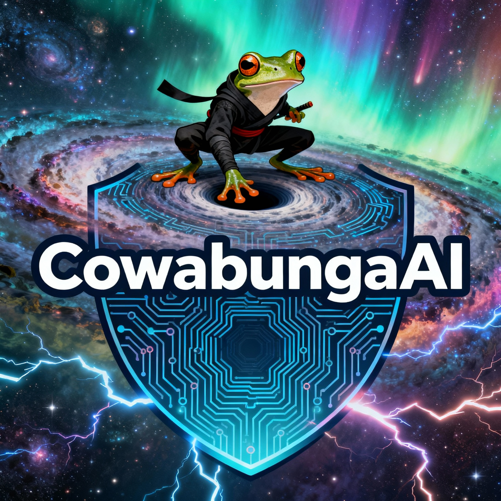

# Comprehensive Renaming Plan: leapfrogai → cowabunga

## Overview
Rename all "leapfrogai" references to "cowabunga" while preserving:
- Docker registry paths (ghcr.io/defenseunicorns/leapfrogai/*)
- Legacy image naming conventions
- Backwards compatibility
- External dependencies

## Phase 1: Discovery & Inventory (Day 1)

### 1.1 Identify All leapfrogai References

```bash
# Find all occurrences of "leapfrogai"
grep -r "leapfrogai" --include="*.py" --include="*.ts" --include="*.js" \
  --include="*.yaml" --include="*.yml" --include="*.md" --include="*.json" \
  --include="Dockerfile" --include="Makefile" . > /tmp/leapfrogai-references.txt

# Categorize by type
grep -r "leapfrogai" . --include="*.py" | wc -l  # Python files
grep -r "leapfrogai" . --include="*.yaml" | wc -l  # YAML files
grep -r "leapfrogai" . --include="*.md" | wc -l  # Documentation
```

### 1.2 Create Inventory Spreadsheet

| File/Location | Type | Can Rename? | Priority | Notes |
|--------------|------|-------------|----------|-------|
| src/leapfrogai_api/ | Directory | Yes | High | Core API |
| src/leapfrogai_ui/ | Directory | Yes | High | Web UI |
| packages/api/ | Config | Partial | Medium | Keep registry refs |
| README.md | Docs | Yes | Low | Documentation |

### 1.3 Categorize References

#### Category A: Must Keep (Legacy/External)
- Docker registry: `ghcr.io/defenseunicorns/leapfrogai/*`
- External dependencies referencing leapfrogai
- User-facing URLs (if already deployed)

#### Category B: Should Rename (Internal)
- Python modules: `src/leapfrogai_api/`, `src/leapfrogai_ui/`
- Package names in zarf.yaml files
- Internal documentation
- Namespace names in Kubernetes

#### Category C: Nice to Have (Cosmetic)
- Comments in code
- Variable names (if isolated)
- Example text in docs

## Phase 2: Registry & Image Strategy (Day 1-2)

### 2.1 Docker Registry Strategy

**Current State:**
```
ghcr.io/defenseunicorns/leapfrogai/api:dev
ghcr.io/defenseunicorns/leapfrogai/ui:dev
ghcr.io/defenseunicorns/leapfrogai/llama-cpp-python:dev
```

**Future State (Hybrid Approach):**
```yaml
# Option 1: Dual Tagging (Recommended)
ghcr.io/defenseunicorns/leapfrogai/api:dev      # Legacy (keep for compatibility)
ghcr.io/awdemos/cowabunga/api:dev                # New naming

# Option 2: Registry Migration
ghcr.io/awdemos/cowabunga/api:dev                # New only
# Plus: Migration guide for existing users
```

**Implementation:**
```dockerfile
# Dockerfile changes
# OLD:
LABEL org.opencontainers.image.title="leapfrogai-api"

# NEW:
LABEL org.opencontainers.image.title="cowabunga-api"
LABEL org.opencontainers.image.description="CowabungaAI API (formerly LeapfrogAI)"

# Keep old label for compatibility
LABEL org.opencontainers.image.title.legacy="leapfrogai-api"
```

### 2.2 Makefile Changes

```makefile
# Makefile
# Keep backward compatibility

# Image registry (dual support)
REGISTRY ?= ghcr.io/awdemos
LEGACY_REGISTRY ?= ghcr.io/defenseunicorns/leapfrogai

# Build with dual tags
docker build -t ${REGISTRY}/cowabunga/api:${VERSION} \
             -t ${LEGACY_REGISTRY}/api:${VERSION} \
             -f packages/api/Dockerfile .

# Push both tags
docker push ${REGISTRY}/cowabunga/api:${VERSION}
docker push ${LEGACY_REGISTRY}/api:${VERSION}
```

## Phase 3: Code Refactoring (Day 2-4)

### 3.1 Python Module Renaming

**Directory Structure:**
```bash
# OLD:
src/leapfrogai_api/
src/leapfrogai_ui/
src/leapfrogai_sdk/
src/leapfrogai_evals/

# NEW:
src/cowabunga_api/
src/cowabunga_ui/
src/cowabunga_sdk/
src/cowabunga_evals/

# Keep symlinks for backward compatibility:
ln -s src/cowabunga_api src/leapfrogai_api
ln -s src/cowabunga_ui src/leapfrogai_ui
```

**Import Updates:**
```python
# OLD:
from leapfrogai_api import app
from leapfrogai_sdk import BaseService

# NEW (with backward compatibility):
try:
    from cowabunga_api import app
except ImportError:
    from leapfrogai_api import app  # Fallback

# Or use __init__.py aliases:
# src/cowabunga_api/__init__.py
from cowabunga_api.main import app
__all__ = ['app']

# For backward compatibility:
import sys
sys.modules['leapfrogai_api'] = sys.modules['cowabunga_api']
```

### 3.2 Kubernetes Resources

**Namespace:**
```yaml
# OLD:
apiVersion: v1
kind: Namespace
metadata:
  name: leapfrogai

# NEW:
apiVersion: v1
kind: Namespace
metadata:
  name: cowabunga
  labels:
    app.kubernetes.io/name: cowabunga
    # Keep old label for compatibility
    app.kubernetes.io/instance: leapfrogai
```

**Deployments:**
```yaml
# OLD:
apiVersion: apps/v1
kind: Deployment
metadata:
  name: leapfrogai-api
  namespace: leapfrogai
spec:
  selector:
    matchLabels:
      app: leapfrogai-api

# NEW:
apiVersion: apps/v1
kind: Deployment
metadata:
  name: cowabunga-api
  namespace: cowabunga
  labels:
    app.kubernetes.io/name: cowabunga-api
    app.kubernetes.io/part-of: cowabunga
spec:
  selector:
    matchLabels:
      app: cowabunga-api
      # Keep old label for compatibility
      app-legacy: leapfrogai-api
```

### 3.3 Helm Charts

```yaml
# Chart.yaml
apiVersion: v2
name: cowabunga  # OLD: leapfrogai
description: CowabungaAI API - Self-hosted AI platform
version: 0.1.0
appVersion: "1.0.0"

# Keep old name as alias
annotations:
  artifacthub.io/alias: "leapfrogai"
```

## Phase 4: Configuration Files (Day 3-4)

### 4.1 Zarf Packages

```yaml
# packages/api/zarf.yaml
kind: ZarfPackageConfig
metadata:
  name: cowabunga-api  # OLD: leapfrogai-api
  description: CowabungaAI API package

components:
  - name: cowabunga-api
    required: true
    charts:
      - name: cowabunga-api
        version: 0.1.0
        namespace: cowabunga
    images:
      # Keep legacy registry path
      - ghcr.io/defenseunicorns/leapfrogai/api:dev
```

### 4.2 Environment Variables

```bash
# .env.example
# OLD: LEAPFROGAI_API_URL
# NEW: COWABUNGA_API_URL

# Keep both for compatibility
LEAPFROGAI_API_URL=http://cowabunga-api.cowabunga.svc.cluster.local
COWABUNGA_API_URL=http://cowabunga-api.cowabunga.svc.cluster.local
```

### 4.3 Makefile Updates

```makefile
# Makefile
.PHONY: help
help: ## Display this help information
	@grep -E '^[a-zA-Z0-9_-]+:.*?## .*$$' $(MAKEFILE_LIST) \
		| sort | awk 'BEGIN {FS = ":.*?## "}; \
		{printf "\033[36m%-30s\033[0m %s\n", $$1, $$2}'

# Build targets (dual naming)
build-api: build-cowabunga-api  # Alias for backward compatibility
build-cowabunga-api: ## Build the CowabungaAI API
	docker build -t ghcr.io/awdemos/cowabunga/api:${LOCAL_VERSION} \
	             -t ghcr.io/defenseunicorns/leapfrogai/api:${LOCAL_VERSION} \
	             -f packages/api/Dockerfile .
```

## Phase 5: Documentation (Day 4-5)

### 5.1 README.md

```markdown
# CowabungaAI

**Formerly known as LeapfrogAI**



CowabungaAI is a self-hosted AI platform designed for air-gapped environments.

> **Note:** This project was previously named "LeapfrogAI". All references are being updated to "CowabungaAI". 
> Docker images and some configuration may still reference "leapfrogai" for backward compatibility.
```

### 5.2 Migration Guide

Create `docs/MIGRATION_LEAPFROGAI_TO_COWABUNGA.md`:

```markdown
# Migration Guide: LeapfrogAI → CowabungaAI

## Overview
This guide helps you migrate from LeapfrogAI to CowabungaAI.

## Breaking Changes
- Python imports: `from leapfrogai_api` → `from cowabunga_api`
- Namespace: `leapfrogai` → `cowabunga`
- Environment variables: `LEAPFROGAI_*` → `COWABUNGA_*`

## Backward Compatibility
The following are kept for compatibility:
- Docker images: `ghcr.io/defenseunicorns/leapfrogai/*` (still work)
- Old environment variables still accepted
- Python imports with fallback support

## Migration Steps
1. Update environment variables
2. Update Kubernetes namespace
3. Update Python imports
4. Update Helm values

[Continue with detailed steps...]
```

### 5.3 API Documentation

```python
# src/cowabunga_api/__init__.py
"""
CowabungaAI API

OpenAI-compatible API for self-hosted AI.

Formerly known as LeapfrogAI API.
For backward compatibility, imports from 'leapfrogai_api' still work.
"""

__version__ = "1.0.0"
__author__ = "CowabungaAI Team"
__description__ = "Self-hosted AI platform (formerly LeapfrogAI)"
```

## Phase 6: Testing Strategy (Day 5-6)

### 6.1 Automated Tests

```python
# tests/test_compatibility.py
import pytest

def test_import_backward_compatibility():
    """Test that old import paths still work"""
    # Old imports should work
    from leapfrogai_api import app
    assert app is not None
    
    # New imports should work
    from cowabunga_api import app as new_app
    assert new_app is not None
    
    # Should be the same
    assert app == new_app

def test_environment_variables():
    """Test that both old and new env vars work"""
    import os
    os.environ['LEAPFROGAI_API_URL'] = 'http://old'
    os.environ['COWABUNGA_API_URL'] = 'http://new'
    
    from cowabunga_api.config import get_api_url
    # Should prefer new, fallback to old
    assert get_api_url() == 'http://new'

def test_docker_image_tags():
    """Test that both image tags exist"""
    import docker
    client = docker.from_env()
    
    # Both tags should exist
    old_image = client.images.get('ghcr.io/defenseunicorns/leapfrogai/api:dev')
    new_image = client.images.get('ghcr.io/awdemos/cowabunga/api:dev')
    
    # Should be the same image
    assert old_image.id == new_image.id
```

### 6.2 Integration Tests

```bash
# tests/integration/test_deployment.sh
#!/bin/bash

# Test deployment with old namespace
kubectl apply -f k8s/legacy/
kubectl wait --for=condition=Ready pods -n leapfrogai --all

# Test deployment with new namespace
kubectl apply -f k8s/
kubectl wait --for=condition=Ready pods -n cowabunga --all

# Test both can coexist
curl http://leapfrogai-api.leapfrogai.svc.cluster.local/health
curl http://cowabunga-api.cowabunga.svc.cluster.local/health
```

### 6.3 Compatibility Matrix

| Component | Old Name | New Name | Compatibility |
|-----------|----------|----------|---------------|
| Python module | leapfrogai_api | cowabunga_api | Both work |
| Docker image | leapfrogai/api | cowabunga/api | Dual-tagged |
| K8s namespace | leapfrogai | cowabunga | Separate |
| Helm chart | leapfrogai | cowabunga | Separate |
| Config env | LEAPFROGAI_* | COWABUNGA_* | Both accepted |

## Phase 7: Rollout Plan (Day 6-7)

### 7.1 Pre-Rollout Checklist

- [ ] All code changes committed
- [ ] Tests passing (unit, integration, compatibility)
- [ ] Documentation updated
- [ ] Migration guide published
- [ ] Docker images dual-tagged
- [ ] Backward compatibility verified
- [ ] Team notified

### 7.2 Rollout Steps

**Step 1: Feature Branch (Week 1)**
```bash
git checkout -b rename/leapfrogai-to-cowabunga
# Make all changes
# Run all tests
# Create PR
```

**Step 2: Staging Deployment (Week 2)**
```bash
# Deploy to staging with dual naming
kubectl apply -f k8s/staging/
# Verify both old and new work
# Run smoke tests
```

**Step 3: Production Deployment (Week 3)**
```bash
# Blue-green deployment
# Route 10% traffic to new naming
# Monitor for 24 hours
# Increase to 50%
# Monitor for 24 hours
# Complete rollout
```

**Step 4: Deprecation Notice (Month 2)**
```markdown
# Deprecation Notice

**LeapfrogAI naming is deprecated**

- Old imports will be removed in v2.0.0
- Old Docker image tags will be maintained for 1 year
- Old environment variables will be removed in v2.0.0
- Migration deadline: 2027-03-08
```

### 7.3 Rollback Plan

```bash
# If issues arise, rollback is simple:
kubectl rollout undo deployment/cowabunga-api -n cowabunga
kubectl rollout undo deployment/leapfrogai-api -n leapfrogai

# Or switch traffic back:
kubectl patch service cowabunga-api -p '{"spec":{"selector":{"app":"leapfrogai-api"}}}'
```

## Phase 8: File-by-File Changes (Detailed)

### 8.1 Root Directory

```bash
# Files to update:
README.md                           # Update all references
DEPLOYMENT_SUMMARY.md                # Update references
TURSO_INTEGRATION_PLAN.md            # Update references
Makefile                             # Update targets, add aliases
pyproject.toml                       # Update package names
setup.py                             # Update module paths
```

### 8.2 Source Directories

```bash
# Rename directories:
src/leapfrogai_api/ → src/cowabunga_api/
src/leapfrogai_ui/ → src/cowabunga_ui/
src/leapfrogai_sdk/ → src/cowabunga_sdk/
src/leapfrogai_evals/ → src/cowabunga_evals/

# Create compatibility symlinks:
src/leapfrogai_api → src/cowabunga_api
src/leapfrogai_ui → src/cowabunga_ui
src/leapfrogai_sdk → src/cowabunga_sdk
src/leapfrogai_evals → src/cowabunga_evals

# Update all Python imports in:
src/cowabunga_*/**/*.py              # All Python files
tests/**/*.py                        # All test files
```

### 8.3 Package Directories

```bash
# packages/api/
├── Dockerfile                       # Update labels, keep registry refs
├── zarf.yaml                         # Update name, keep image refs
├── chart/
│   ├── Chart.yaml                   # Update name
│   ├── values.yaml                  # Update image refs (keep legacy)
│   └── templates/
│       └── deployment.yaml          # Update labels/selectors

# packages/ui/
├── Dockerfile                       # Similar changes
├── zarf.yaml
├── chart/
│   └── ...

# packages/llama-cpp-python/
├── Dockerfile
├── zarf.yaml
└── ...

# packages/supabase/
├── zarf.yaml
└── ...
```

### 8.4 Configuration Files

```yaml
# k8s/*.yaml - Update all:
- metadata.name: leapfrogai-* → cowabunga-*
- metadata.namespace: leapfrogai → cowabunga
- labels.app: leapfrogai-* → cowabunga-*
- spec.selector.matchLabels.app: leapfrogai-* → cowabunga-*

# Keep for compatibility:
- annotations.legacy-name: leapfrogai-*
```

### 8.5 Documentation

```bash
# docs/
├── README.md                        # Update all references
├── DEVELOPMENT.md                   # Update code examples
├── DEPLOYMENT.md                    # Update commands
├── API.md                          # Update endpoints
├── MIGRATION_LEAPFROGAI_TO_COWABUNGA.md  # NEW: Migration guide
└── img/
    └── leapfrogai_logo.png → cowabungaai_logo.png
```

## Phase 9: Automation Scripts

### 9.1 Rename Script

```bash
#!/bin/bash
# scripts/rename-leapfrogai-to-cowabunga.sh

set -e

echo "Starting rename process..."

# 1. Rename directories
echo "Renaming directories..."
for dir in src/leapfrogai_*; do
    new_dir=$(echo "$dir" | sed 's/leapfrogai/cowabunga/')
    git mv "$dir" "$new_dir"
    # Create symlink for compatibility
    ln -s "$new_dir" "$dir"
done

# 2. Update Python imports
echo "Updating Python imports..."
find src tests -name "*.py" -type f -exec sed -i '' \
    's/from leapfrogai_/from cowabunga_/g' {} \;
find src tests -name "*.py" -type f -exec sed -i '' \
    's/import leapfrogai_/import cowabunga_/g' {} \;

# 3. Update YAML files (but not registry paths)
echo "Updating YAML files..."
find . -name "*.yaml" -o -name "*.yml" | while read file; do
    # Skip files with registry paths
    if ! grep -q "ghcr.io/defenseunicorns/leapfrogai" "$file"; then
        sed -i '' 's/leapfrogai/cowabunga/g' "$file"
    else
        # Update selectively, keeping registry paths
        sed -i '' 's/name: leapfrogai/name: cowabunga/g' "$file"
        sed -i '' 's/namespace: leapfrogai/namespace: cowabunga/g' "$file"
    fi
done

# 4. Update documentation
echo "Updating documentation..."
find docs -name "*.md" -type f -exec sed -i '' \
    's/LeapfrogAI/CowabungaAI/g' {} \;
find . -name "README.md" -type f -exec sed -i '' \
    's/LeapfrogAI/CowabungaAI/g' {} \;

echo "Rename complete. Please review changes and run tests."
```

### 9.2 Compatibility Check Script

```bash
#!/bin/bash
# scripts/check-backward-compatibility.sh

echo "Checking backward compatibility..."

# Check that old imports still work
python3 -c "from leapfrogai_api import app; print('✓ Old imports work')" || exit 1
python3 -c "from cowabunga_api import app; print('✓ New imports work')" || exit 1

# Check that both env vars work
export LEAPFROGAI_API_URL=http://test
python3 -c "from cowabunga_api.config import get_api_url; assert get_api_url() == 'http://test'" || exit 1

export COWABUNGA_API_URL=http://test2
python3 -c "from cowabunga_api.config import get_api_url; assert get_api_url() == 'http://test2'" || exit 1

# Check Docker images
docker inspect ghcr.io/defenseunicorns/leapfrogai/api:dev > /dev/null 2>&1 && echo "✓ Legacy image exists" || echo "✗ Legacy image missing"
docker inspect ghcr.io/awdemos/cowabunga/api:dev > /dev/null 2>&1 && echo "✓ New image exists" || echo "✗ New image missing"

echo "Compatibility check complete."
```

## Phase 10: Risk Mitigation

### 10.1 Potential Issues

| Issue | Risk | Mitigation |
|-------|------|------------|
| Broken imports | High | Keep symlinks, dual imports |
| Docker pull failures | Critical | Dual-tag all images |
| Namespace conflicts | Medium | Test both namespaces coexist |
| CI/CD pipeline breaks | High | Update all pipelines, test thoroughly |
| User confusion | Medium | Clear migration guide, deprecation notices |
| External dependencies | Low | Audit all external refs |

### 10.2 Testing Checklist

- [ ] Unit tests pass with new names
- [ ] Integration tests pass with new names
- [ ] Old imports still work
- [ ] New imports work
- [ ] Both Docker tags pull successfully
- [ ] Kubernetes deployments work in both namespaces
- [ ] Helm charts install successfully
- [ ] Documentation renders correctly
- [ ] Links not broken
- [ ] API endpoints respond correctly
- [ ] UI loads without errors

## Timeline Summary

| Phase | Duration | Start | End |
|-------|----------|-------|-----|
| 1. Discovery | 1 day | Day 1 | Day 1 |
| 2. Registry Strategy | 2 days | Day 1 | Day 2 |
| 3. Code Refactoring | 3 days | Day 2 | Day 4 |
| 4. Config Updates | 2 days | Day 3 | Day 4 |
| 5. Documentation | 2 days | Day 4 | Day 5 |
| 6. Testing | 2 days | Day 5 | Day 6 |
| 7. Rollout | 2 days | Day 6 | Day 7 |
| 8. Validation | 1 day | Day 7 | Day 7 |

**Total Duration:** 7 working days

## Success Criteria

- [ ] All "leapfrogai" references updated (except legacy registry)
- [ ] All tests passing
- [ ] Backward compatibility maintained
- [ ] Documentation complete
- [ ] Migration guide published
- [ ] Dual-tagged Docker images
- [ ] Both old and new imports work
- [ ] Zero downtime deployment
- [ ] Team trained on changes

## Post-Rollout Tasks

1. **Month 1:** Monitor for issues, gather feedback
2. **Month 2:** Publish deprecation notice
3. **Month 6:** Remove old symlinks (if no issues)
4. **Month 12:** Remove legacy Docker tags (major version bump)
5. **Month 18:** Complete removal of all legacy references

---

**Created:** 2026-03-08
**Status:** Ready to execute
**Estimated Effort:** 7 days
**Risk Level:** Medium (mitigated by backward compatibility)
**Worktree:** To be created on branch `rename/leapfrogai-to-cowabunga`
