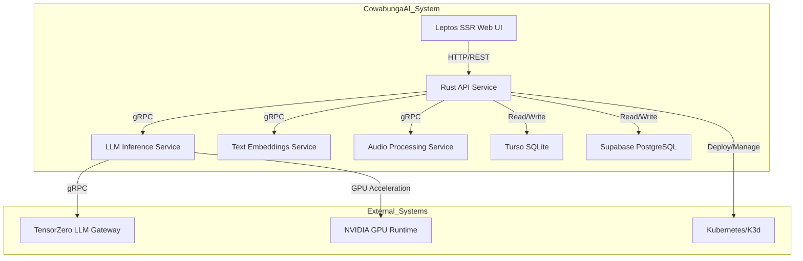
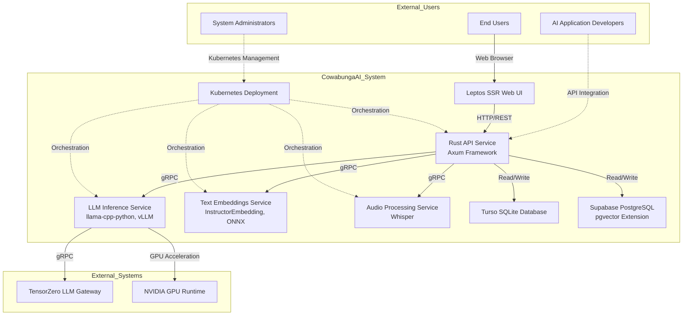
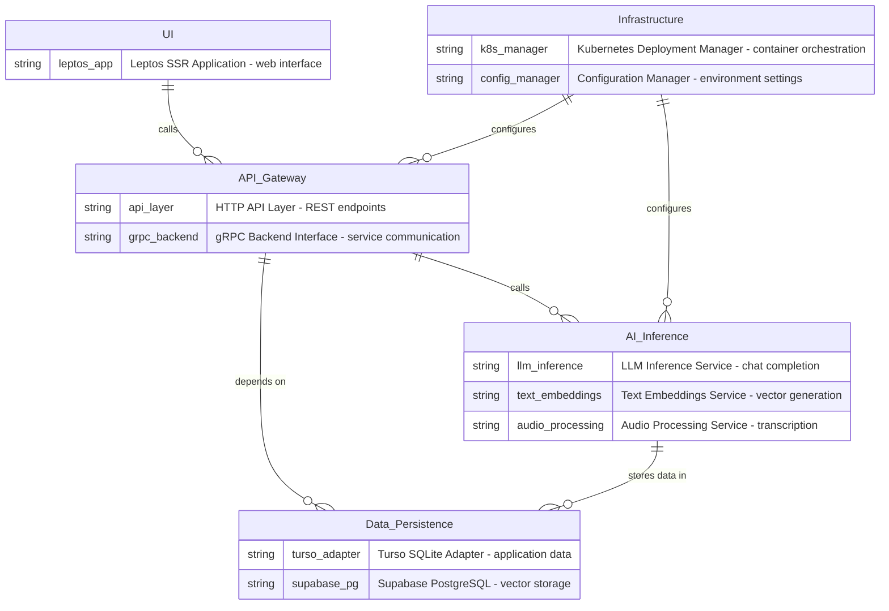

# CowabungaAI - System Context Architecture Document

## 1. Project Introduction

### 1.1 Project Overview

**CowabungaAI** is an enterprise-grade AI-powered chat assistant platform that provides self-hosted large language model (LLM) capabilities with comprehensive AI infrastructure. The system enables organizations to deploy custom AI models on-premises or in private cloud environments, reducing dependency on external AI services while maintaining full control over data privacy and model deployment.

### 1.2 Core Business Value

The platform delivers the following key business capabilities:

- **Self-Hosted LLM Infrastructure**: Deploy custom AI models with GPU/CPU support without relying on external AI service providers
- **Enterprise-Grade AI Services**: Provides chat completion, text embeddings, audio transcription, and vector search capabilities
- **Data Privacy & Control**: All AI processing occurs within the organization's infrastructure, ensuring data sovereignty
- **Microservices Architecture**: Modular design enables independent scaling and maintenance of AI services
- **Developer-Friendly APIs**: RESTful and gRPC interfaces for easy integration with existing applications

### 1.3 Technical Characteristics

| Characteristic | Description |
|---------------|-------------|
| **Architecture Pattern** | Microservices with clear domain separation |
| **Primary Languages** | Rust (API, UI, Infrastructure) and Python (AI Inference) |
| **Deployment** | Kubernetes-based container orchestration |
| **Communication** | HTTP/REST for client interactions, gRPC for inter-service communication |
| **Database Strategy** | Dual-database approach (SQLite for application data, PostgreSQL with pgvector for vector storage) |
| **AI Frameworks** | llama-cpp-python, vLLM, InstructorEmbedding, ONNX Runtime, Whisper |

---

## 2. Target Users

### 2.1 User Role Definitions

The CowabungaAI platform serves three primary user groups with distinct interaction patterns and requirements:

#### 2.1.1 AI Application Developers

**Description**: Software engineers who build AI-powered applications and chatbots using the CowabungaAI platform.

**Primary Needs**:
- Access to LLM inference APIs for chat completion
- Text embedding generation for semantic search
- Audio transcription services for voice input
- Vector search functionality for RAG applications

**Usage Scenarios**:
- Integrating CowabungaAI APIs into custom applications
- Building chatbots with natural language understanding
- Creating document search systems with vector embeddings
- Developing voice-to-text applications

#### 2.1.2 System Administrators

**Description**: DevOps engineers responsible for managing AI infrastructure deployments and operational health.

**Primary Needs**:
- Kubernetes deployment management and orchestration
- GPU resource configuration and monitoring
- Database migration and maintenance support
- Service health monitoring and alerting

**Usage Scenarios**:
- Deploying and updating AI services on Kubernetes clusters
- Configuring GPU resources for model inference
- Managing database schemas and migrations
- Monitoring service performance and resource utilization

#### 2.1.3 End Users

**Description**: Users who interact with AI chat assistants through the web interface.

**Primary Needs**:
- Natural language chat interface for conversational AI
- Conversation history management and retrieval
- File upload and storage capabilities
- Real-time response streaming for chat interactions

**Usage Scenarios**:
- Engaging in natural language conversations with AI assistant
- Uploading documents for analysis and search
- Recording and transcribing audio conversations
- Managing chat history and preferences

---

## 3. System Boundaries

### 3.1 System Scope Definition

The CowabungaAI system encompasses a complete self-hosted AI assistant platform with microservices architecture. The system includes all components required for AI inference, data persistence, user interaction, and infrastructure management within the organization's control.

### 3.2 Included Components

The following components are **included** within the CowabungaAI system boundary:

| Component | Description | Technology |
|-----------|-------------|------------|
| **Rust API Service** | Central API service with Axum framework | Rust, Axum |
| **LLM Inference Services** | Llama-cpp-python and vLLM backends | Python, llama-cpp-python, vLLM |
| **Text Embeddings Service** | Vector embedding generation | InstructorEmbedding, ONNX |
| **Audio Processing Service** | Whisper-based transcription | Python, Whisper |
| **Leptos SSR Web UI** | Server-side rendered chat interface | Rust, Leptos |
| **Turso SQLite Adapter** | Application data persistence | Rust, libSQL |
| **Supabase PostgreSQL** | Vector storage and user data | Python, PostgreSQL, pgvector |
| **Kubernetes Deployment** | Container orchestration | Kubernetes, K3d |
| **gRPC Service Stubs** | Inter-service communication | Rust, gRPC |

### 3.3 Excluded Components

The following components are **excluded** from the CowabungaAI system boundary:

| Component | Reason for Exclusion |
|-----------|---------------------|
| External LLM provider APIs beyond TensorZero gateway | Out of scope - uses internal TensorZero gateway |
| Third-party vector database services | Uses Supabase PostgreSQL with pgvector |
| External audio processing services beyond Whisper | Uses internal Whisper implementation |
| Production Kubernetes cluster infrastructure | Infrastructure management is external |
| CI/CD pipeline systems | DevOps tooling is external to the application |

---

## 4. External System Interactions

### 4.1 External System Dependencies

The CowabungaAI platform interacts with several external systems to provide complete functionality:

#### 4.1.1 TensorZero (LLM Gateway)

| Attribute | Value |
|-----------|-------|
| **Description** | LLM gateway service for model inference requests |
| **Interaction Type** | gRPC |
| **Purpose** | Routes inference requests to appropriate LLM backends |
| **Direction** | CowabungaAI → TensorZero |

#### 4.1.2 Supabase (PostgreSQL Database)

| Attribute | Value |
|-----------|-------|
| **Description** | PostgreSQL database with pgvector extension for vector storage |
| **Interaction Type** | Database Connection |
| **Purpose** | Stores user data, conversation history, and vector embeddings |
| **Direction** | Bidirectional |

#### 4.1.3 Turso (SQLite Database)

| Attribute | Value |
|-----------|-------|
| **Description** | SQLite database for application data persistence |
| **Interaction Type** | Database Connection |
| **Purpose** | Stores application-level data and metadata |
| **Direction** | Bidirectional |

#### 4.1.4 NVIDIA GPU Runtime

| Attribute | Value |
|-----------|-------|
| **Description** | GPU acceleration infrastructure for model inference |
| **Interaction Type** | Infrastructure |
| **Purpose** | Provides GPU resources for LLM inference workloads |
| **Direction** | CowabungaAI → GPU Runtime |

#### 4.1.5 Kubernetes/K3d

| Attribute | Value |
|-----------|-------|
| **Description** | Container orchestration platform for service deployment |
| **Interaction Type** | Infrastructure |
| **Purpose** | Manages container deployment, scaling, and lifecycle |
| **Direction** | Bidirectional |

### 4.2 Interaction Flow Analysis

---

## 5. System Context Diagram

### 5.1 High-Level Architecture View

The following diagram illustrates the CowabungaAI system context, showing how the platform interacts with external systems and serves different user groups.

### 5.2 Key Interaction Flows

#### 5.2.1 Chat Completion Flow

1. **User Interface**: End user submits chat message through Leptos SSR web interface
2. **API Gateway**: Rust API service receives and validates the chat request
3. **Backend Interface**: API forwards request to LLM backend via gRPC
4. **LLM Inference**: LLM service generates response with streaming token output
5. **Data Persistence**: Conversation history and message objects stored in Turso SQLite

#### 5.2.2 Text Embedding Generation Flow

1. **API Gateway**: Receives text embedding request from client
2. **Embeddings Service**: Text embeddings service processes input text using InstructorEmbedding/ONNX
3. **Vector Storage**: Embeddings stored in Supabase PostgreSQL vector_store table

#### 5.2.3 Audio Transcription Flow

1. **User Interface**: User uploads audio file through web interface
2. **API Gateway**: API receives and validates audio upload request
3. **Audio Processing**: Whisper model transcribes audio to text
4. **Data Persistence**: Transcribed text and audio metadata stored in Turso SQLite

---

## 6. Technical Architecture Overview

### 6.1 Technology Stack

| Layer | Technology | Purpose |
|-------|-----------|---------|
| **Frontend** | Leptos (Rust) | Server-side rendered web UI |
| **API Layer** | Axum (Rust) | RESTful API endpoints |
| **AI Inference** | llama-cpp-python, vLLM | LLM model inference |
| **Embeddings** | InstructorEmbedding, ONNX | Text to vector conversion |
| **Audio Processing** | Whisper | Speech to text transcription |
| **Database (App)** | Turso (libSQL) | Application data persistence |
| **Database (Vector)** | Supabase (PostgreSQL + pgvector) | Vector storage and search |
| **Orchestration** | Kubernetes/K3d | Container deployment management |
| **Communication** | gRPC | Inter-service communication |
| **Infrastructure** | NVIDIA GPU Runtime | GPU acceleration for inference |

### 6.2 Architecture Patterns

#### 6.2.1 Microservices Architecture

The system employs a microservices architecture with clear domain separation:

- **AI Inference Domain**: Core AI capabilities (LLM, embeddings, audio)
- **API Gateway Domain**: Central service layer for request routing
- **Data Persistence Domain**: Dual-database strategy for different use cases
- **User Interface Domain**: Web application layer
- **Infrastructure Domain**: Deployment and configuration management

#### 6.2.2 Dual-Database Strategy

The system uses two database technologies for different purposes:

| Database | Use Case | Technology |
|----------|----------|------------|
| **Turso SQLite** | Application data, conversation history, metadata | libSQL/Turso |
| **Supabase PostgreSQL** | Vector embeddings, user authentication, RAG | PostgreSQL + pgvector |

#### 6.2.3 gRPC Inter-Service Communication

Internal services communicate using gRPC for:
- Low-latency inter-service communication
- Type-safe service interfaces
- Efficient binary serialization
- Backend abstraction for LLM inference

### 6.3 Key Design Decisions

| Decision | Rationale |
|----------|-----------|
| **Rust for API and UI** | Memory safety, performance, and type safety for critical infrastructure |
| **Python for AI Services** | Rich ecosystem of AI/ML libraries and frameworks |
| **Kubernetes Deployment** | Scalability, container orchestration, and resource management |
| **Dual-Database Approach** | SQLite for transactional data, PostgreSQL for vector search capabilities |
| **gRPC for Internal Communication** | Performance and type safety for service-to-service calls |
| **Self-Hosted LLMs** | Data privacy, cost control, and customization |

### 6.4 Domain Module Relationships

---

## 7. Architecture Decision Record (ADR) Summary

### 7.1 Technology Selection Decisions

| ADR | Decision | Impact |
|-----|----------|--------|
| **ADR-001** | Use Rust for API and UI | Improved performance and security |
| **ADR-002** | Use Python for AI services | Access to mature AI/ML ecosystem |
| **ADR-003** | Implement gRPC for internal communication | Better performance than REST for internal calls |
| **ADR-004** | Dual-database strategy | Optimized for different data access patterns |
| **ADR-005** | Kubernetes deployment | Scalability and resource management |

### 7.2 Future Considerations

| Area | Consideration | Status |
|------|---------------|--------|
| **Model Management** | Dynamic model loading and versioning | Planned |
| **Monitoring** | Enhanced observability and metrics | In Progress |
| **Security** | Enhanced authentication and authorization | Planned |
| **Scaling** | Horizontal scaling of inference services | Planned |
| **Multi-Tenancy** | Support for multiple organizations | Future |

---

## 8. Document Information

| Attribute | Value |
|-----------|-------|
| **Document Title** | CowabungaAI System Context Architecture |
| **Document Level** | C4 SystemContext |
| **Last Updated** | 1789315828 |
| **Confidence Score** | 8.5/10 |
| **Author** | Architecture Documentation Team |
| **Review Status** | Pending Review |

---

*This document provides a high-level overview of the CowabungaAI system context. For detailed component-level information, refer to the C4 Container and Component level documentation.*