# CowabungaAI Architecture Documentation

## 1. Architecture Overview

### 1.1 Architecture Design Philosophy

CowabungaAI is architected as a **self-hosted AI assistant platform** that prioritizes enterprise-grade capabilities while maintaining flexibility for custom model deployment. The architecture follows **Domain-Driven Design (DDD)** principles with clear separation between business domains and infrastructure concerns. The system emphasizes **modularity**, **performance**, and **observability** through a microservices architecture pattern.

### 1.2 Core Architecture Patterns

| Pattern | Description | Implementation |
|---------|-------------|----------------|
| **Microservices Architecture** | Independent deployable services with clear boundaries | Rust crates + Python packages |
| **gRPC Inter-Service Communication** | High-performance typed RPC for service-to-service calls | Protobuf definitions with generated SDK |
| **Dual-Database Strategy** | SQLite for application data, PostgreSQL for vector storage | Turso (libSQL) + Supabase (pgvector) |
| **Backend Abstraction Layer** | Interface-based backend communication with stub support | gRPC Backend Interface with StubBackend |
| **Server-Side Rendering** | SSR for optimal initial page load performance | Leptos SSR framework |
| **Streaming Responses** | Server-sent events for real-time chat interactions | Streaming token output |

### 1.3 Technology Stack Overview

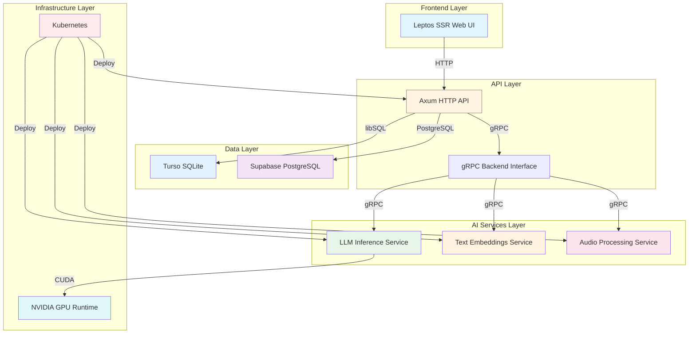

### 1.4 Technology Selection Rationale

| Component | Technology | Rationale |
|-----------|------------|-----------|
| **API Framework** | Axum (Rust) | High performance, type safety, async support |
| **Web UI** | Leptos SSR | Server-side rendering, Rust ecosystem |
| **AI Inference** | llama-cpp-python, vLLM | GPU/CPU support, streaming capabilities |
| **Embeddings** | InstructorEmbedding + ONNX | Efficient vector generation |
| **Audio Processing** | Whisper | Industry-standard speech recognition |
| **Database (App)** | Turso (libSQL) | SQLite over network, lightweight |
| **Database (Vector)** | Supabase PostgreSQL | pgvector extension, vector search |
| **Orchestration** | Kubernetes | Container management, scaling |

---

## 2. System Context

### 2.1 System Positioning and Value

CowabungaAI provides **enterprise-grade AI chat assistant infrastructure** with self-hosted LLM capabilities. The system reduces dependency on external AI services while enabling custom model deployment with GPU/CPU support. This architecture empowers organizations to maintain data privacy, control inference costs, and customize AI behavior according to specific business requirements.

**Business Value Proposition:**
- **Self-Hosted AI**: Full control over model deployment and data privacy
- **Cost Efficiency**: Eliminates per-call costs associated with external AI APIs
- **Customization**: Ability to deploy custom models and fine-tune behavior
- **Scalability**: Kubernetes-based deployment supports horizontal scaling
- **Flexibility**: Dual-database strategy optimizes for different data access patterns

### 2.2 User Roles and Scenarios

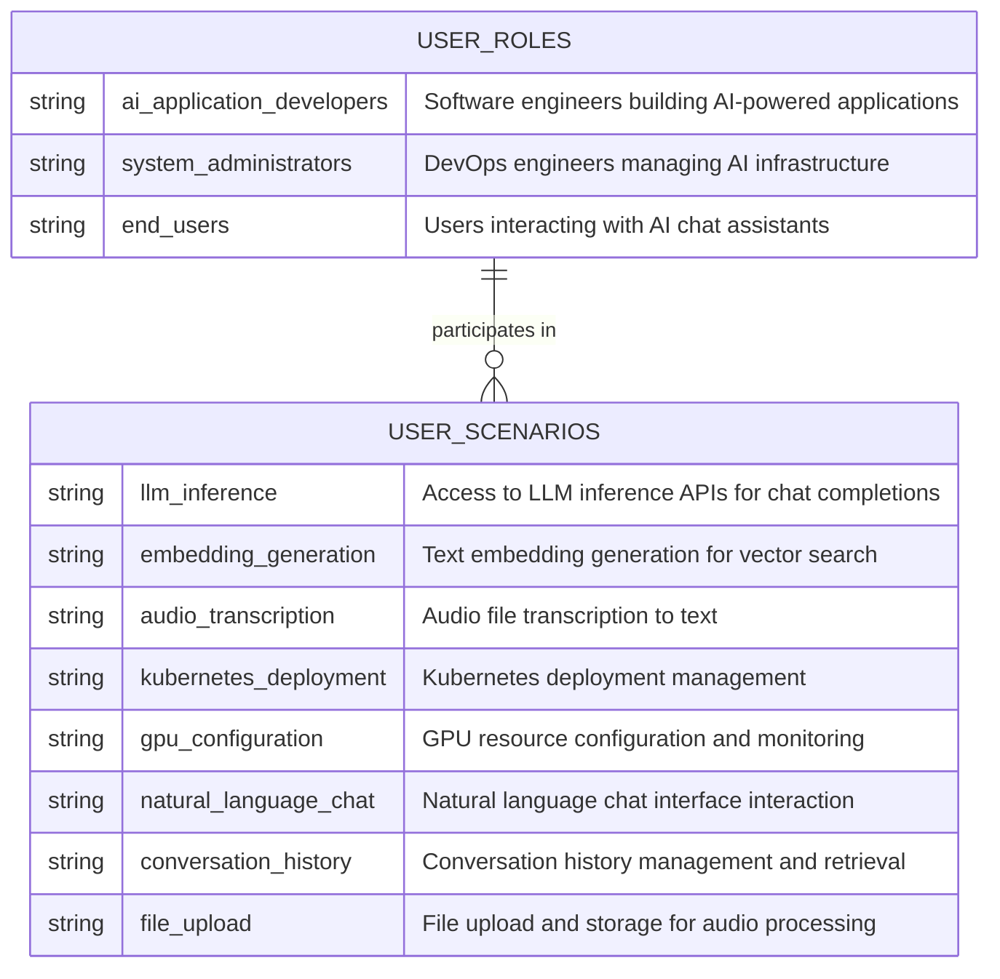

| User Role | Description | Key Needs |
|-----------|-------------|-----------|
| **AI Application Developers** | Software engineers building AI-powered applications | LLM inference APIs, text embeddings, audio transcription, vector search |
| **System Administrators** | DevOps engineers managing AI infrastructure | Kubernetes deployment, GPU configuration, database migrations, service health monitoring |
| **End Users** | Users interacting with AI chat assistants through the UI | Natural language interface, conversation history, file uploads, real-time response streaming |

### 2.3 External System Interactions

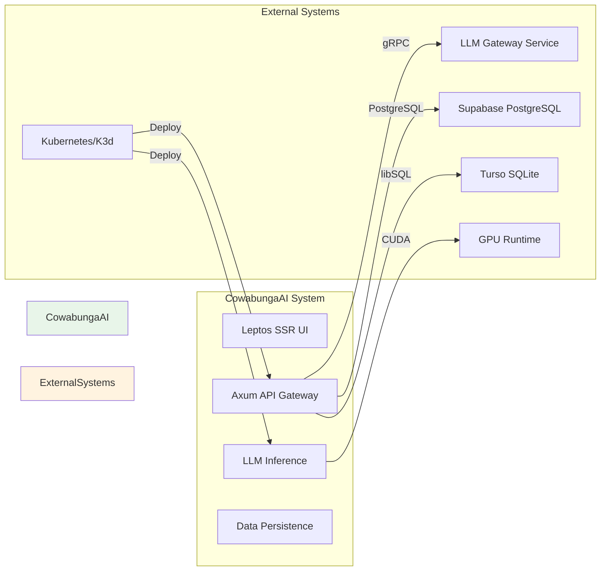

| External System | Type | Interaction | Purpose |
|-----------------|------|-------------|---------|
| **TensorZero** | LLM Gateway | gRPC | Model inference requests and routing |
| **Supabase** | Database | PostgreSQL | Vector storage, user authentication, conversation management |
| **Turso** | Database | libSQL | Application data, user sessions, API keys |
| **NVIDIA GPU Runtime** | Infrastructure | CUDA | GPU acceleration for model inference |
| **Kubernetes/K3d** | Orchestration | Container | Service deployment and management |

### 2.4 System Boundary Definition

**Included Components:**
- Rust API service with Axum framework
- Python LLM inference services (llama-cpp-python, vLLM)
- Text embeddings service (InstructorEmbedding, ONNX)
- Whisper audio transcription service
- Leptos SSR web UI
- Turso SQLite database adapter
- Supabase PostgreSQL integration
- Kubernetes deployment manifests
- gRPC service stubs and repeater

**Excluded Components:**
- External LLM provider APIs beyond TensorZero gateway
- Third-party vector database services
- External audio processing services beyond Whisper
- Production Kubernetes cluster infrastructure
- CI/CD pipeline systems

---

## 3. Container View

### 3.1 Domain Module Architecture

The system is organized into **five primary domains** with clear separation of concerns:

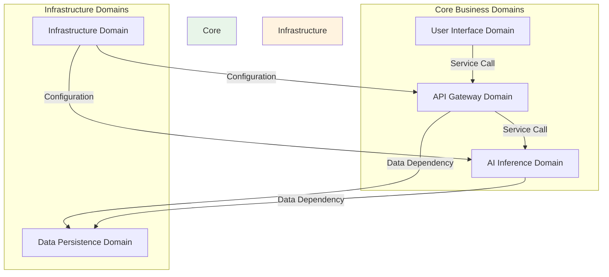

### 3.2 Container-Level Architecture

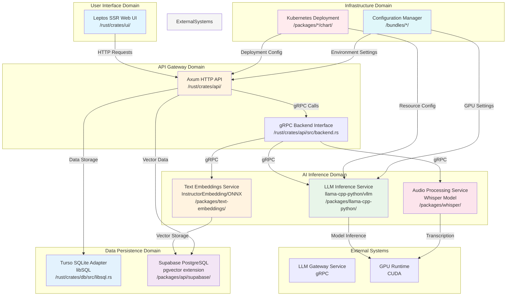

### 3.3 Domain Module Details

#### 3.3.1 User Interface Domain

| Attribute | Value |
|-----------|-------|
| **Entry Point** | `/rust/crates/ui/src/main.rs` |
| **Framework** | Leptos SSR on Axum |
| **Complexity** | 6.0/10 |
| **Importance** | 8.0/10 |
| **Type** | Core Business Domain |

**Key Functions:**
- Chat interface rendering with server-side rendering
- Conversation history display and management
- File upload handling for audio transcription
- Real-time response streaming display

**Code Structure:**
```
rust/crates/ui/
├── src/
│   ├── main.rs          # Application entry point
│   └── app.rs           # Main application logic
```

#### 3.3.2 API Gateway Domain

| Attribute | Value |
|-----------|-------|
| **Entry Point** | `/rust/crates/api/src/main.rs` |
| **Framework** | Axum with gRPC backend abstraction |
| **Complexity** | 7.5/10 |
| **Importance** | 9.0/10 |
| **Type** | Core Business Domain |

**Key Functions:**
- RESTful API endpoints for client interactions
- gRPC backend interface abstraction
- Authentication and authorization
- Request validation and routing
- Streaming response support

**Code Structure:**
```
rust/crates/api/
├── src/
│   ├── main.rs          # Application entry point
│   ├── router.rs        # HTTP routing configuration
│   ├── backend.rs       # gRPC backend interface
│   ├── auth.rs          # Authentication logic
│   └── types.rs         # Request/response types
```

#### 3.3.3 AI Inference Domain

| Attribute | Value |
|-----------|-------|
| **Entry Points** | Multiple Python packages |
| **Complexity** | 8.5/10 |
| **Importance** | 9.5/10 |
| **Type** | Core Business Domain |

**Sub-modules:**

**LLM Inference Service**
- **Backends**: llama-cpp-python, vllm
- **Functions**: Chat completion streaming, token counting, model inference
- **GPU/CPU Support**: Via environment configuration

**Text Embeddings Service**
- **Backend**: InstructorEmbedding with ONNX runtime
- **Functions**: Text to vector embedding generation
- **Interface**: gRPC-based service interface

**Audio Processing Service**
- **Backend**: Faster Whisper model
- **Functions**: Audio transcription, speech-to-text conversion
- **Acceleration**: GPU acceleration support

#### 3.3.4 Data Persistence Domain

| Attribute | Value |
|-----------|-------|
| **Entry Points** | Multiple adapters |
| **Complexity** | 7.0/10 |
| **Importance** | 8.5/10 |
| **Type** | Infrastructure Domain |

**Dual Database Strategy:**

**Turso SQLite Adapter**
- **Technology**: libSQL/Turso (SQLite over network)
- **Functions**: Connection management, migrations, health checks
- **Use Cases**: Application data, user sessions, API keys

**Supabase PostgreSQL Integration**
- **Technology**: PostgreSQL with pgvector extension
- **Functions**: User authentication, conversation management, vector search
- **Use Cases**: Vector embeddings, chat history, metadata

#### 3.3.5 Infrastructure Domain

| Attribute | Value |
|-----------|-------|
| **Entry Points** | Configuration bundles |
| **Complexity** | 5.0/10 |
| **Importance** | 7.5/10 |
| **Type** | Infrastructure Domain |

**Sub-modules:**

**Kubernetes Deployment Manager**
- **Functions**: Pod management, resource configuration, service deployment
- **Artifacts**: Helm charts, deployment manifests

**Configuration Manager**
- **Functions**: GPU settings, environment variables, resource limits
- **Artifacts**: UDS configuration files

### 3.4 Inter-Domain Communication

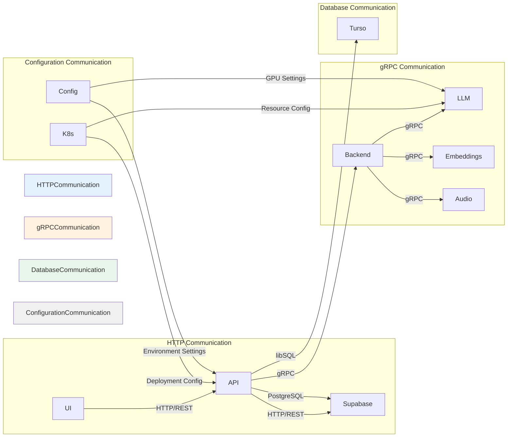

### 3.5 Storage Design

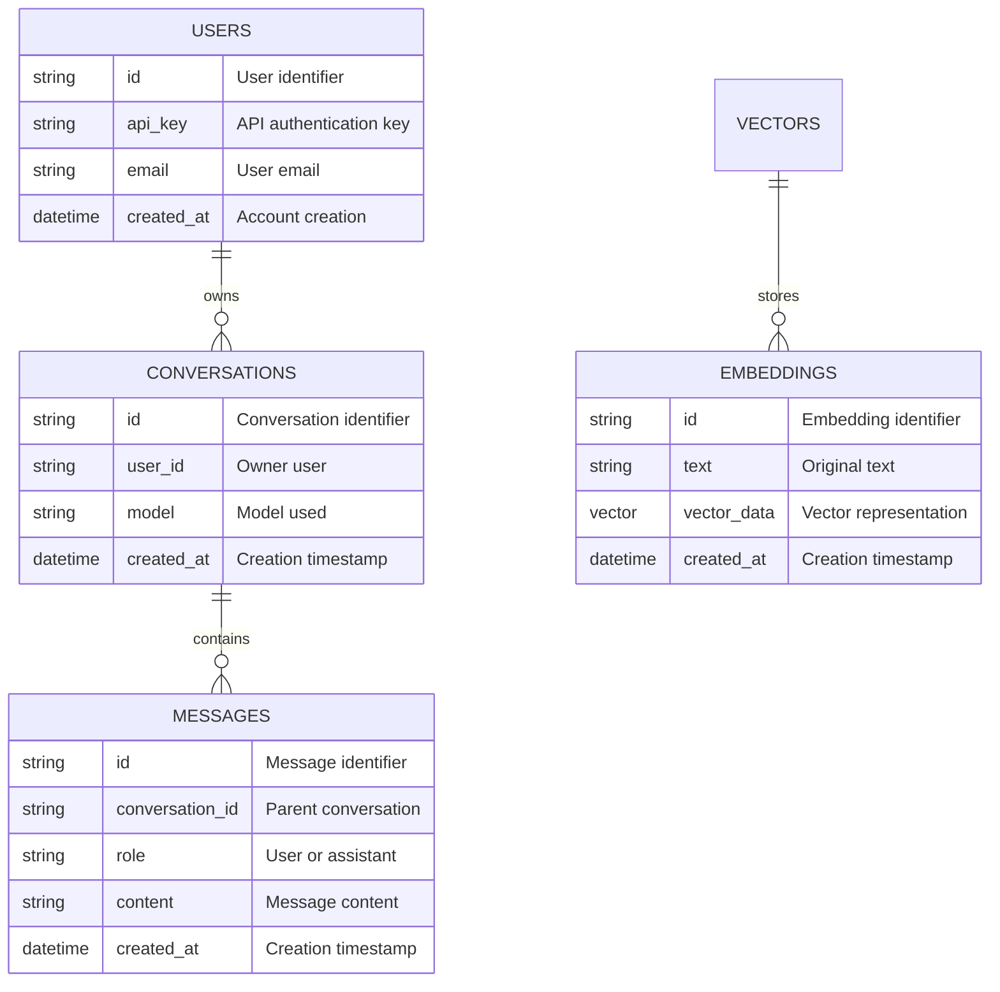

| Database | Technology | Primary Use Cases |
|----------|------------|-------------------|
| **Turso SQLite** | libSQL | Application data, user sessions, API keys, conversation history |
| **Supabase PostgreSQL** | PostgreSQL + pgvector | Vector embeddings, user authentication, complex queries, vector search |

---

## 4. Component View

### 4.1 Core Functional Components

#### 4.1.1 API Gateway Components

```mermaid
componentDiagram
    component API_Gateway : Axum HTTP API
        component Router : HTTP Routing
        component Auth : Authentication
        component Backend : gRPC Backend Interface
        component Streaming : Response Streaming
    end
    
    API_Gateway --> Router : Routes requests
    API_Gateway --> Auth : Validates authentication
    API_Gateway --> Backend : Forwards to backend
    API_Gateway --> Streaming : Handles streaming responses
```

**Component Responsibilities:**

| Component | Responsibility | Key Functions |
|-----------|----------------|---------------|
| **Router** | HTTP request routing and dispatch | Chat endpoints, model management, health checks |
| **Auth** | Authentication and authorization | API key validation, request validation |
| **Backend** | gRPC backend communication | GrpcBackend, StubBackend, Backend trait |
| **Streaming** | Server-sent events handling | Chat completion streaming, SSE support |

#### 4.1.2 AI Inference Components

```mermaid
componentDiagram
    component LLM_Service : LLM Inference Service
        component llama_cpp : llama-cpp-python Backend
        component vllm : vLLM Backend
        component TokenCounter : Token Counting
    end
    
    component Embeddings_Service : Text Embeddings Service
        component Instructor : InstructorEmbedding
        component ONNX : ONNX Runtime
    end
    
    component Audio_Service : Audio Processing Service
        component Whisper : Whisper Model
        component Transcriber : Speech-to-Text
    end
    
    LLM_Service --> llama_cpp : Model inference
    LLM_Service --> vllm : Model inference
    LLM_Service --> TokenCounter : Token counting
    Embeddings_Service --> Instructor : Embedding generation
    Embeddings_Service --> ONNX : Embedding generation
    Audio_Service --> Whisper : Audio processing
    Audio_Service --> Transcriber : Transcription
```

**Component Responsibilities:**

| Component | Responsibility | Key Functions |
|-----------|----------------|---------------|
| **LLM Service** | Large language model inference | Chat completion, streaming, token counting |
| **Embeddings Service** | Vector embedding generation | Text to vector conversion, ONNX runtime |
| **Audio Service** | Audio transcription | Whisper model, speech-to-text conversion |

#### 4.1.3 Data Persistence Components

```mermaid
componentDiagram
    component Turso_Adapter : Turso SQLite Adapter
        component ConnectionManager : Connection Pooling
        component Migrations : Schema Migrations
        component HealthCheck : Service Health
    end
    
    component Supabase_Integration : Supabase PostgreSQL
        component VectorStore : Vector Storage
        component Auth : User Authentication
        component Conversation : Conversation Management
    end
    
    Turso_Adapter --> ConnectionManager : Manages connections
    Turso_Adapter --> Migrations : Handles migrations
    Turso_Adapter --> HealthCheck : Monitors health
    Supabase_Integration --> VectorStore : Stores vectors
    Supabase_Integration --> Auth : Manages authentication
    Supabase_Integration --> Conversation : Manages conversations
```

**Component Responsibilities:**

| Component | Responsibility | Key Functions |
|-----------|----------------|---------------|
| **Turso Adapter** | SQLite database operations | Connection management, migrations, health checks |
| **Supabase Integration** | PostgreSQL database operations | Vector storage, user auth, conversation management |

### 4.2 Technical Support Components

```mermaid
componentDiagram
    component K8s_Deployment : Kubernetes Deployment Manager
        component HelmCharts : Helm Chart Templates
        component PodManager : Pod Lifecycle Management
        component ServiceConfig : Service Configuration
    end
    
    component Config_Manager : Configuration Manager
        component GPUConfig : GPU Settings
        component EnvVars : Environment Variables
        component ResourceLimits : Resource Limits
    end
    
    component gRPC_SDK : gRPC SDK
        component ChatService : Chat Completion Service
        component EmbeddingsService : Embeddings Service
        component AudioService : Audio Service
    end
    
    K8s_Deployment --> HelmCharts : Generates manifests
    K8s_Deployment --> PodManager : Manages pods
    K8s_Deployment --> ServiceConfig : Configures services
    Config_Manager --> GPUConfig : GPU configuration
    Config_Manager --> EnvVars : Environment variables
    Config_Manager --> ResourceLimits : Resource limits
    gRPC_SDK --> ChatService : Chat operations
    gRPC_SDK --> EmbeddingsService : Embedding operations
    gRPC_SDK --> AudioService : Audio operations
```

### 4.3 Component Interaction Relationships

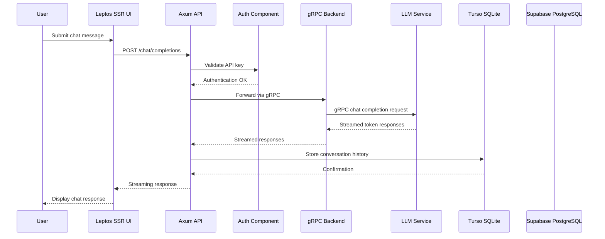

### 4.4 Component Interface Specifications

**gRPC Service Definitions:**

| Service | Method | Request | Response |
|---------|--------|---------|----------|
| **ChatCompletionService** | ChatCompletion | ChatRequest | ChatResponse |
| **ChatCompletionStreamService** | StreamChatCompletion | ChatRequest | StreamResponse |
| **EmbeddingsService** | GenerateEmbeddings | EmbeddingRequest | EmbeddingResponse |
| **AudioService** | Transcribe | TranscriptionRequest | TranscriptionResponse |
| **CountingService** | CountTokens | TokenCountRequest | TokenCountResponse |
| **NameService** | GetModelName | NameRequest | NameResponse |

**HTTP API Endpoints:**

| Endpoint | Method | Description |
|----------|--------|-------------|
| `/v1/chat/completions` | POST | Chat completion with streaming |
| `/v1/embeddings` | POST | Text embedding generation |
| `/v1/audio/transcriptions` | POST | Audio file transcription |
| `/health` | GET | Health check endpoint |
| `/models` | GET | List available models |

---

## 5. Key Processes

### 5.1 Core Functional Processes

#### 5.1.1 Chat Completion Flow

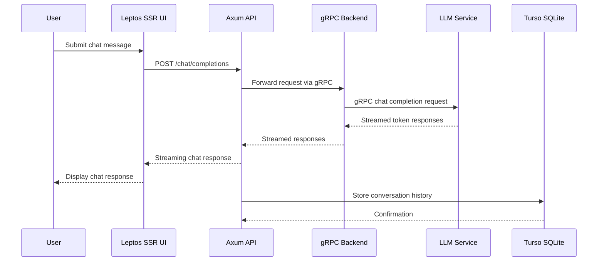

**Process Steps:**

| Step | Component | Operation | Purpose |
|------|-----------|-----------|---------|
| 1 | User Interface Domain | User submits chat message via web interface | Capture user input and initiate conversation |
| 2 | API Gateway Domain | API receives and validates chat request | Authenticate request and validate input parameters |
| 3 | API Gateway Domain | API forwards request to LLM backend via gRPC | Route request to appropriate inference service |
| 4 | AI Inference Domain | LLM generates response with streaming token output | Process natural language and generate AI response |
| 5 | Data Persistence Domain | Store conversation history and message objects | Persist conversation context for future reference |

**Importance Score:** 9.5/10

#### 5.1.2 Text Embedding Generation Flow

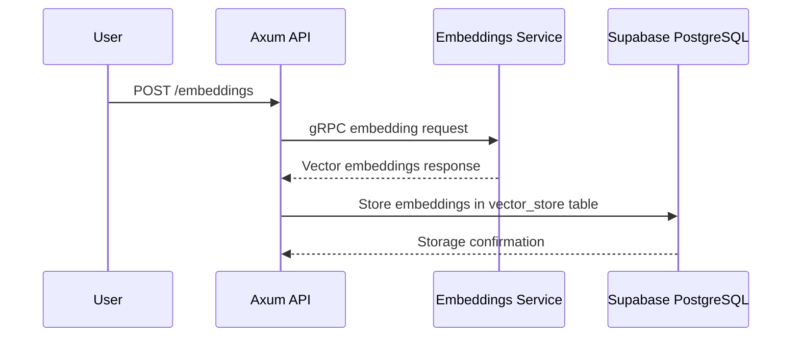

**Process Steps:**

| Step | Component | Operation | Purpose |
|------|-----------|-----------|---------|
| 1 | API Gateway Domain | API receives text embedding request | Accept embedding generation request |
| 2 | AI Inference Domain | Text embeddings service processes input text | Convert text to vector representation |
| 3 | Data Persistence Domain | Store vector embeddings in vector_store table | Persist embeddings for vector search |

**Importance Score:** 8.0/10

#### 5.1.3 Audio Transcription Flow

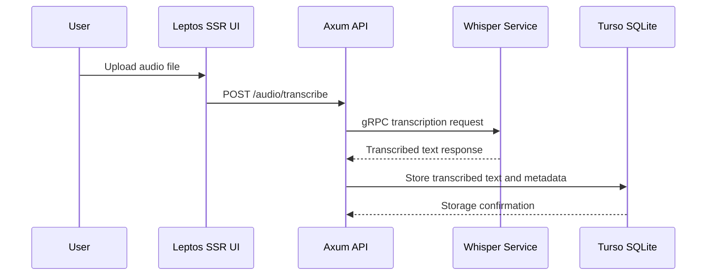

**Process Steps:**

| Step | Component | Operation | Purpose |
|------|-----------|-----------|---------|
| 1 | User Interface Domain | User uploads audio file through UI | Capture audio input from user |
| 2 | API Gateway Domain | API receives and validates audio upload request | Validate file format and size constraints |
| 3 | AI Inference Domain | Whisper model transcribes audio to text | Process audio and extract speech content |
| 4 | Data Persistence Domain | Store transcribed text and audio metadata | Persist transcription results for retrieval |

**Importance Score:** 7.5/10

### 5.2 Technical Processing Workflows

#### 5.2.1 Model Deployment Flow

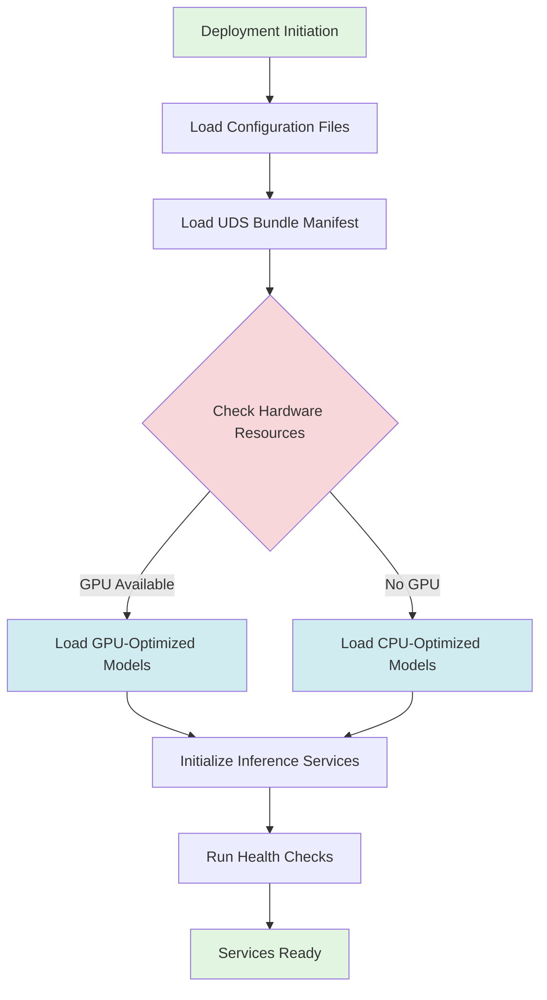

**Process Steps:**

| Step | Component | Operation | Purpose |
|------|-----------|-----------|---------|
| 1 | Infrastructure Domain | Load uds-config.yaml and uds-bundle.yaml | Read deployment configuration |
| 2 | Infrastructure Domain | Check hardware resources (GPU/CPU) | Determine available compute resources |
| 3 | AI Inference Domain | Initialize appropriate model backends | Load llama-cpp-python or vLLM based on hardware |
| 4 | AI Inference Domain | Run health checks and readiness probes | Verify service availability |

#### 5.2.2 Data Flow Paths

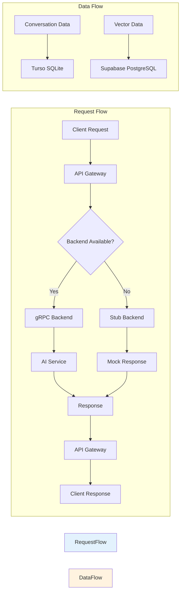

### 5.3 Exception Handling Mechanisms

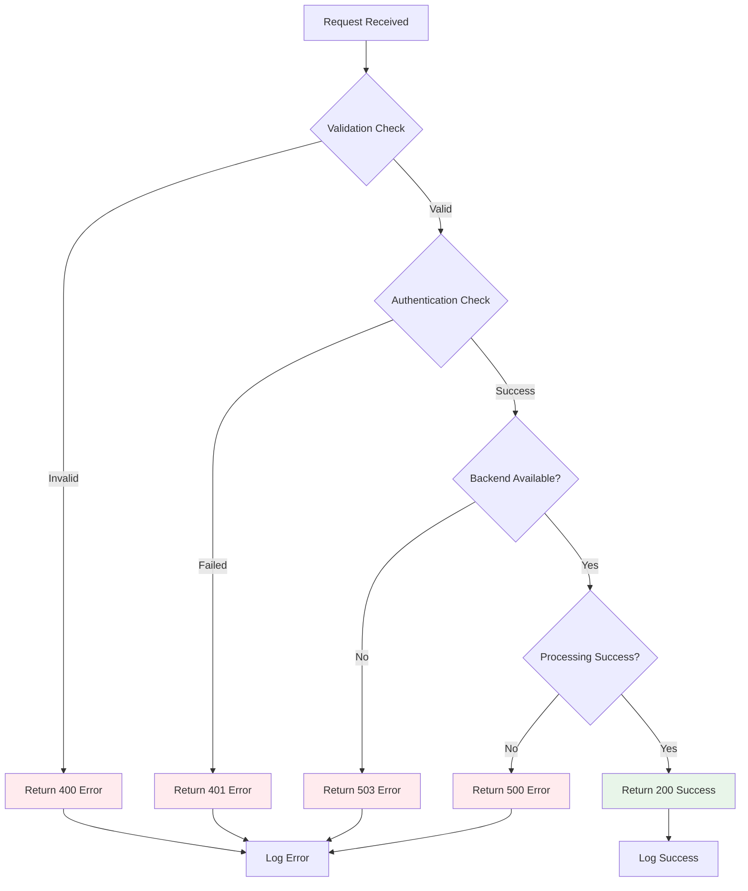

**Error Handling Strategy:**

| Error Type | HTTP Status | Response | Recovery |
|------------|-------------|----------|----------|
| **Validation Error** | 400 | Detailed error message | Client-side validation |
| **Authentication Error** | 401 | Invalid API key | Re-authenticate |
| **Backend Unavailable** | 503 | Service temporarily unavailable | Retry with backoff |
| **Processing Error** | 500 | Internal server error | Log and alert |
| **Rate Limit Exceeded** | 429 | Too many requests | Wait and retry |

---

## 6. Technical Implementation

### 6.1 Core Module Implementation

#### 6.1.1 API Gateway Implementation

**Entry Point:** `/rust/crates/api/src/main.rs`

**Key Implementation Details:**

```rust
// Main application entry point
fn main() {
    let app = Axum::new()
        .add_routes(router)
        .add_service(gRPC_service);
    
    app.run(listener).await.unwrap();
}

// gRPC Backend Interface
pub trait Backend {
    async fn chat_completion(&self, request: ChatRequest) -> Result<ChatResponse>;
    async fn generate_embeddings(&self, request: EmbeddingRequest) -> Result<EmbeddingResponse>;
    async fn transcribe_audio(&self, request: TranscriptionRequest) -> Result<TranscriptionResponse>;
}

// Production implementation
pub struct GrpcBackend {
    client: GrpcClient,
}

// Development stub implementation
pub struct StubBackend {
    mock_responses: HashMap<String, MockResponse>,
}
```

**Framework:** Axum with async runtime

**Key Features:**
- Async/await support for non-blocking I/O
- Type-safe request/response handling
- Middleware for authentication and logging
- Streaming response support

#### 6.1.2 AI Inference Implementation

**Entry Points:**
- `/packages/llama-cpp-python/main.py`
- `/packages/text-embeddings/main.py`
- `/packages/whisper/main.py`

**Key Implementation Details:**

```python
# LLM Inference Service
class LLMService:
    def __init__(self, model_path, device="cuda"):
        self.model = load_model(model_path, device)
        self.device = device
    
    async def chat_completion(self, messages, stream=True):
        if stream:
            return self.stream_chat(messages)
        return self.generate(messages)
    
    async def stream_chat(self, messages):
        async for token in self.model.generate(messages):
            yield token

# Text Embeddings Service
class EmbeddingsService:
    def __init__(self, model_path):
        self.model = load_model(model_path)
    
    def generate_embeddings(self, texts):
        return self.model.encode(texts)

# Audio Processing Service
class AudioService:
    def __init__(self, model_path):
        self.model = load_model(model_path)
    
    def transcribe(self, audio_file):
        return self.model.transcribe(audio_file)
```

**Framework:** Python with async support

**Key Features:**
- GPU/CPU device selection
- Streaming token output
- ONNX runtime optimization
- Whisper model integration

#### 6.1.3 Data Persistence Implementation

**Entry Points:**
- `/rust/crates/db/src/libsql.rs`
- `/packages/api/supabase/migrations/`

**Key Implementation Details:**

```rust
// Turso SQLite Adapter
pub struct TursoAdapter {
    client: libsql::Client,
}

impl TursoAdapter {
    pub async fn new(url: &str) -> Self {
        let client = libsql::connect(url).await.unwrap();
        Self { client }
    }
    
    pub async fn save_conversation(&self, conversation: Conversation) {
        self.client.execute(
            "INSERT INTO conversations (...) VALUES (...)",
            params
        ).await.unwrap();
    }
}

// Supabase PostgreSQL Integration
pub struct SupabaseIntegration {
    client: pgvector::Client,
}

impl SupabaseIntegration {
    pub async fn store_embedding(&self, embedding: Embedding) {
        self.client.execute(
            "INSERT INTO vector_store (...) VALUES (...)",
            params
        ).await.unwrap();
    }
}
```

**Framework:** libSQL for SQLite, pgvector for PostgreSQL

**Key Features:**
- Connection pooling
- Migration support
- Health check endpoints
- Vector search capabilities

### 6.2 Key Algorithm Design

#### 6.2.1 Streaming Chat Completion

**Algorithm:** Server-Sent Events (SSE) for real-time token streaming

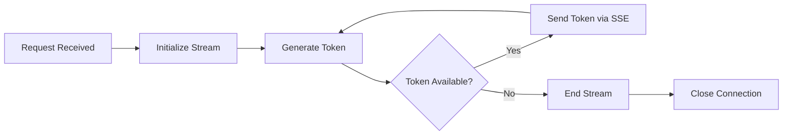

**Implementation:**
- Uses Rust's async stream capabilities
- Implements SSE protocol for browser compatibility
- Maintains connection state for streaming

#### 6.2.2 Vector Embedding Generation

**Algorithm:** InstructorEmbedding with ONNX runtime optimization

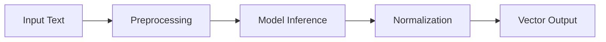

**Implementation:**
- Text preprocessing (tokenization, normalization)
- ONNX runtime for efficient inference
- L2 normalization for vector similarity

### 6.3 Data Structure Design

```mermaid
erDiagram
    CONVERSATION ||--o{ MESSAGE : "contains"
    USER ||--o{ CONVERSATION : "owns"
    EMBEDDING ||--o{ VECTOR : "stores"
    
    CONVERSATION {
        string id PK "Conversation identifier"
        string user_id FK "Owner user"
        string model "Model used"
        string system_prompt "System instructions"
        datetime created_at "Creation timestamp"
        datetime updated_at "Last update"
    }
    
    MESSAGE {
        string id PK "Message identifier"
        string conversation_id FK "Parent conversation"
        string role "User or assistant"
        string content "Message content"
        string model_response "AI response"
        datetime created_at "Creation timestamp"
    }
    
    USER {
        string id PK "User identifier"
        string api_key "API authentication key"
        string email "User email"
        string name "User name"
        datetime created_at "Account creation"
        boolean is_active "Account status"
    }
    
    EMBEDDING {
        string id PK "Embedding identifier"
        string text "Original text"
        vector vector_data "Vector representation"
        string model "Model used"
        datetime created_at "Creation timestamp"
    }
    
    VECTOR {
        string id PK "Vector identifier"
        string embedding_id FK "Parent embedding"
        float similarity "Similarity score"
        string query_text "Search query"
        datetime created_at "Creation timestamp"
    }
```

**Data Structure Characteristics:**

| Structure | Type | Purpose |
|-----------|------|---------|
| **Conversation** | Struct | Stores conversation metadata and context |
| **Message** | Struct | Individual message with role and content |
| **User** | Struct | User account and authentication data |
| **Embedding** | Struct | Text-to-vector mapping |
| **Vector** | Struct | Vector search results and similarity scores |

### 6.4 Performance Optimization Strategies

```mermaid
flowchart TB
    subgraph "Performance Layers"
        A[Request Processing] --> B{Optimization Check}
        B -->|Caching| C[Cache Layer]
        B -->|Connection| D[Connection Pool]
        B -->|Streaming| E[Stream Optimization]
        C --> F[Reduced DB Load]
        D --> G[Improved Concurrency]
        E --> H[Better UX]
    end
    
    style PerformanceLayers fill:#e8f5e9
```

**Optimization Strategies:**

| Strategy | Implementation | Benefit |
|----------|----------------|---------|
| **Connection Pooling** | libSQL connection pool | Reduced connection overhead |
| **Caching Layer** | Redis for embeddings | Reduced database load |
| **Stream Optimization** | Async streaming | Better UX for chat |
| **Model Warm-up** | Pre-load models | Reduced initial latency |
| **GPU Offloading** | CUDA for inference | Faster model processing |

---

## 7. Deployment Architecture

### 7.1 Runtime Environment Requirements

```mermaid
graph TB
    subgraph "Development Environment"
        DevCPU[CPU Bundle<br/>bundles/dev/cpu/]
        DevGPU[GPU Bundle<br/>bundles/dev/gpu/]
    end
    
    subgraph "Production Environment"
        ProdCPU[CPU Bundle<br/>bundles/latest/cpu/]
        ProdGPU[GPU Bundle<br/>bundles/latest/gpu/]
    end
    
    subgraph "Kubernetes"
        APIChart[API Helm Chart<br/>packages/api/chart/]
        LLMChart[LLM Helm Chart<br/>packages/llama-cpp-python/chart/]
        UIChart[UI Helm Chart<br/>packages/ui/chart/]
        EmbeddingsChart[Embeddings Chart<br/>packages/text-embeddings/chart/]
        WhisperChart[Whisper Chart<br/>packages/whisper/chart/]
    end
    
    DevCPU -->|Configuration| APIChart
    DevGPU -->|GPU Settings| LLMChart
    ProdCPU -->|Configuration| APIChart
    ProdGPU -->|GPU Settings| LLMChart
    
    APIChart -->|Deploy| API[API Service]
    LLMChart -->|Deploy| LLM[LLM Service]
    UIChart -->|Deploy| UI[UI Service]
    EmbeddingsChart -->|Deploy| Embeddings[Embeddings Service]
    WhisperChart -->|Deploy| Whisper[Whisper Service]
    
    style Dev fill:#e8f5e9
    style Prod fill:#fff3e0
    style Kubernetes fill:#e3f2fd
```

### 7.2 Deployment Topology Structure

```mermaid
graph TB
    subgraph "External Traffic"
        Internet[Internet]
    end
    
    subgraph "Ingress Layer"
        Ingress[Kubernetes Ingress]
        Nginx[Nginx Reverse Proxy]
    end
    
    subgraph "Application Layer"
        API[API Gateway Service]
        UI[UI Service]
    end
    
    subgraph "AI Services Layer"
        LLM[LLM Inference Service]
        Embeddings[Embeddings Service]
        Audio[Audio Service]
    end
    
    subgraph "Data Layer"
        Turso[Turso SQLite]
        Supabase[Supabase PostgreSQL]
    end
    
    subgraph "Infrastructure Layer"
        K8s[Kubernetes Cluster]
        GPU[NVIDIA GPU Nodes]
        CPU[CPU Nodes]
    end
    
    Internet --> Ingress
    Ingress --> Nginx
    Nginx --> API
    Nginx --> UI
    API --> LLM
    API --> Embeddings
    API --> Audio
    LLM --> GPU
    API --> Turso
    API --> Supabase
    K8s --> API
    K8s --> LLM
    K8s --> Embeddings
    K8s --> Audio
    
    style Internet fill:#e3f2fd
    style Ingress fill:#fff3e0
    style ApplicationLayer fill:#e8f5e9
    style AIServices fill:#fff3e0
    style DataLayer fill:#e3f2fd
    style Infrastructure fill:#f5f5f5
```

### 7.3 Scalability Design

```mermaid
flowchart LR
    subgraph "Horizontal Scaling"
        A[API Service] -->|Replica Set| A1[API Pod 1]
        A -->|Replica Set| A2[API Pod 2]
        A -->|Replica Set| A3[API Pod 3]
    end
    
    subgraph "Vertical Scaling"
        B[LLM Service] -->|Resource Request| B1[GPU Pod]
        B -->|Resource Request| B2[CPU Pod]
    end
    
    subgraph "Auto-Scaling"
        C[HPA Controller] -->|Scale Up| A
        C -->|Scale Down| A
        C -->|Scale Up| B
        C -->|Scale Down| B
    end
    
    style HorizontalScaling fill:#e8f5e9
    style VerticalScaling fill:#fff3e0
    style AutoScaling fill:#e3f2fd
```

**Scalability Strategies:**

| Strategy | Implementation | Use Case |
|----------|----------------|----------|
| **Horizontal Pod Autoscaling** | HPA based on CPU/memory | Traffic spikes |
| **Vertical Scaling** | GPU/CPU resource allocation | Model inference |
| **Service Replication** | Multiple API replicas | High availability |
| **Database Scaling** | Read replicas for queries | Vector search |

### 7.4 Monitoring and Operations

```mermaid
graph TB
    subgraph "Monitoring Stack"
        Prometheus[Prometheus Metrics]
        Grafana[Grafana Dashboards]
        Jaeger[Jaeger Tracing]
    end
    
    subgraph "Components"
        API[API Service]
        LLM[LLM Service]
        UI[UI Service]
        DB[Database Services]
    end
    
    API --> Prometheus
    LLM --> Prometheus
    UI --> Prometheus
    DB --> Prometheus
    
    API --> Jaeger
    LLM --> Jaeger
    UI --> Jaeger
    
    Prometheus --> Grafana
    
    style MonitoringStack fill:#e8f5e9
    style Components fill:#fff3e0
```

**Monitoring Components:**

| Component | Metrics | Alerts |
|-----------|---------|--------|
| **API Service** | Request latency, error rate, throughput | High latency, error spikes |
| **LLM Service** | GPU utilization, inference time, queue depth | GPU saturation, queue backlog |
| **UI Service** | Page load time, session count | High load, slow responses |
| **Database** | Connection count, query time, storage | Connection pool exhaustion |

### 7.5 Security Design

```mermaid
flowchart TB
    subgraph "Security Layers"
        A[Authentication Layer] --> B[Authorization Layer]
        B --> C[Validation Layer]
        C --> D[Encryption Layer]
    end
    
    subgraph "Authentication"
        APIKey[API Key Validation]
        RateLimit[Rate Limiting]
    end
    
    subgraph "Authorization"
        RBAC[Role-Based Access Control]
        Permission[Permission Checks]
    end
    
    subgraph "Validation"
        InputValidation[Input Sanitization]
        SchemaValidation[Schema Validation]
    end
    
    subgraph "Encryption"
        TLS[TLS/HTTPS]
        DataEncryption[Data Encryption at Rest]
    end
    
    APIKey --> A
    RateLimit --> A
    RBAC --> B
    Permission --> B
    InputValidation --> C
    SchemaValidation --> C
    TLS --> D
    DataEncryption --> D
    
    style SecurityLayers fill:#ffebee
```

**Security Mechanisms:**

| Mechanism | Implementation | Protection |
|-----------|----------------|------------|
| **API Key Authentication** | Header-based API key validation | Unauthorized access |
| **Rate Limiting** | Token bucket algorithm | DoS attacks |
| **Input Validation** | Schema validation middleware | Injection attacks |
| **TLS/HTTPS** | Transport encryption | Eavesdropping |
| **Data Encryption** | Database encryption | Data breaches |
| **RBAC** | Role-based access control | Privilege escalation |

### 7.6 Deployment Configuration

**Kubernetes Deployment Manifests:**

```yaml
# API Service Deployment
apiVersion: apps/v1
kind: Deployment
metadata:
  name: api-gateway
spec:
  replicas: 3
  selector:
    matchLabels:
      app: api-gateway
  template:
    spec:
      containers:
      - name: api
        image: cowabungaai/api:latest
        ports:
        - containerPort: 8080
        resources:
          requests:
            memory: "256Mi"
            cpu: "250m"
          limits:
            memory: "512Mi"
            cpu: "500m"
```

**Configuration Management:**

| Configuration File | Purpose | Environment |
|--------------------|---------|-------------|
| `uds-config.yaml` | Runtime configuration | Development/Production |
| `uds-bundle.yaml` | Deployment bundle | Development/Production |
| `deployment.yaml` | Kubernetes manifests | All environments |
| `values.yaml` | Helm chart values | Environment-specific |

### 7.7 Operations Guidance

**Deployment Checklist:**

- [ ] Verify Kubernetes cluster health
- [ ] Check GPU resource availability
- [ ] Validate database connections
- [ ] Review environment variables
- [ ] Test health check endpoints
- [ ] Verify service mesh connectivity
- [ ] Check monitoring stack connectivity
- [ ] Review security policies

**Monitoring Dashboard:**

```mermaid
graph TB
    subgraph "Key Metrics"
        M1[Request Rate]
        M2[Response Latency]
        M3[Error Rate]
        M4[Resource Utilization]
        M5[Queue Depth]
    end
    
    subgraph "Alerts"
        A1[High Latency]
        A2[Error Spike]
        A3[Resource Exhaustion]
        A4[Service Down]
    end
    
    M1 --> A1
    M2 --> A1
    M3 --> A2
    M4 --> A3
    M5 --> A4
    
    style Metrics fill:#e8f5e9
    style Alerts fill:#ffebee
```

**Operational Best Practices:**

1. **Regular Health Checks**: Monitor service health every 30 seconds
2. **Log Aggregation**: Centralize logs for debugging
3. **Backup Strategy**: Regular database backups
4. **Disaster Recovery**: Document recovery procedures
5. **Performance Testing**: Regular load testing
6. **Security Audits**: Periodic security reviews

---

## Appendix: Architecture Decision Records (ADRs)

### ADR-001: Microservices Architecture

**Decision**: Adopt microservices architecture with clear domain boundaries

**Context**: System requires independent scaling of AI services and data layers

**Consequences**: 
- ✅ Independent deployment and scaling
- ✅ Technology diversity (Rust/Python)
- ⚠️ Increased operational complexity

### ADR-002: gRPC for Inter-Service Communication

**Decision**: Use gRPC for service-to-service communication

**Context**: Need high-performance, typed communication between microservices

**Consequences**:
- ✅ Low latency communication
- ✅ Strong typing and contracts
- ⚠️ Requires protobuf knowledge

### ADR-003: Dual-Database Strategy

**Decision**: Use SQLite for application data, PostgreSQL for vector storage

**Context**: Different data access patterns require different database technologies

**Consequences**:
- ✅ Optimized for different use cases
- ✅ Cost-effective storage
- ⚠️ Data consistency complexity

### ADR-004: Streaming Responses

**Decision**: Implement streaming for chat completions

**Context**: Users expect real-time response visibility

**Consequences**:
- ✅ Better user experience
- ✅ Reduced perceived latency
- ⚠️ Increased connection management complexity

---

## References

1. **CowabungaAI Repository**: `/var/home/a/code/cowabungaai/`
2. **Rust Crates**: `/rust/crates/`
3. **Python Packages**: `/packages/`
4. **Kubernetes Charts**: `/packages/*/chart/`
5. **Configuration Bundles**: `/bundles/`

---

*Document Version: 1.0*  
*Last Updated: 1789316104*  
*Generated by: Architecture Documentation System*