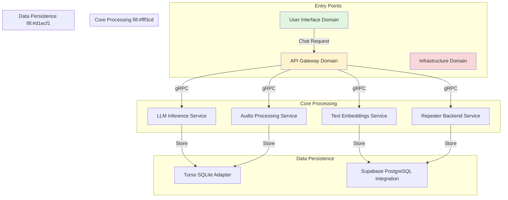
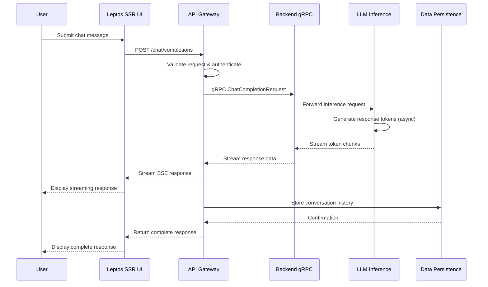
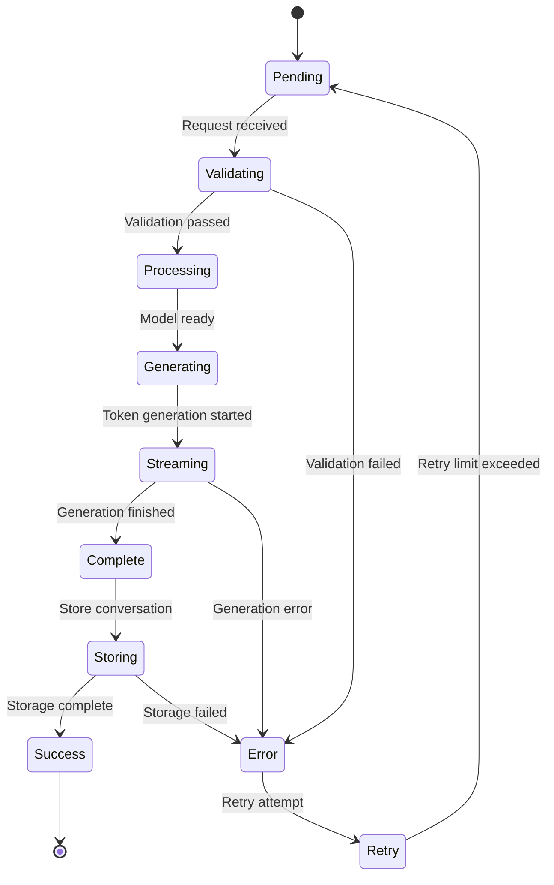
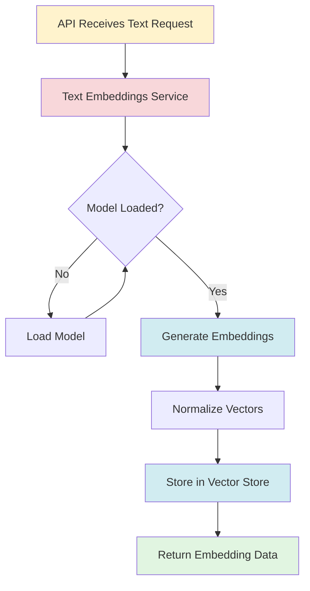
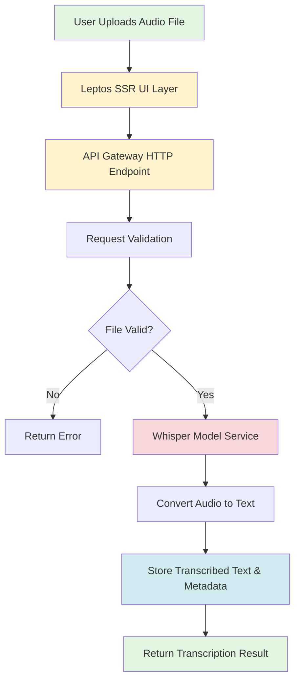
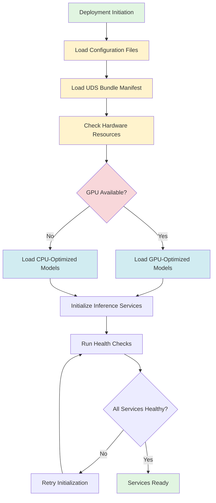
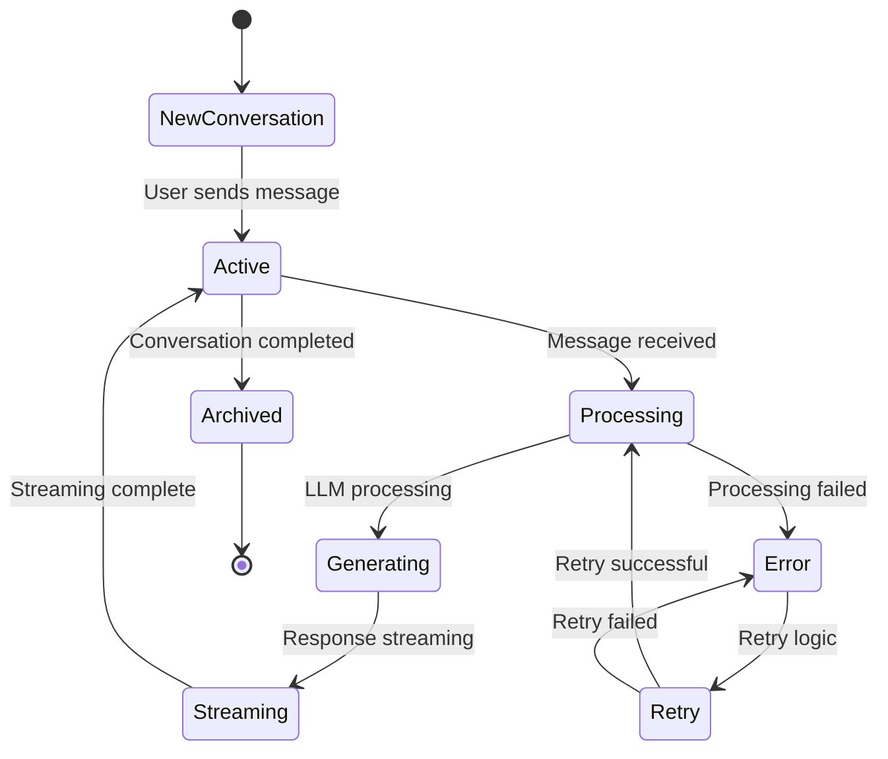
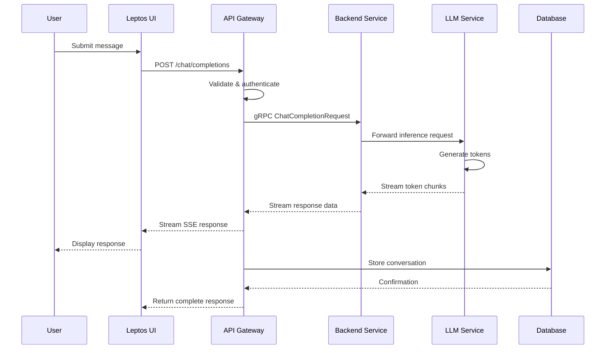
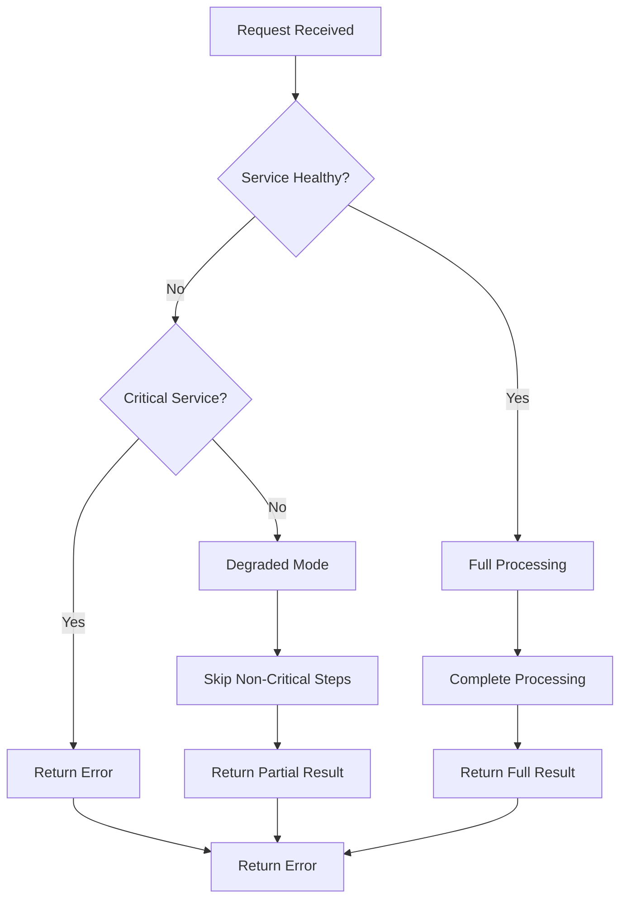

# Core Workflows

## 1. Workflow Overview

### 1.1 System Architecture and Workflow Context

CowabungaAI is a self-hosted AI assistant platform built on a microservices architecture that integrates Rust and Python technologies. The system orchestrates multiple AI capabilities including Large Language Model (LLM) inference, text embeddings, audio processing, and vector search through a coordinated workflow system.

**Core Value Proposition**: Provides enterprise-grade AI chat assistant infrastructure with self-hosted LLM capabilities, reducing dependency on external AI services while enabling custom model deployment with GPU/CPU support.

**System Boundaries**:
- **Included Components**: Rust API service with Axum framework, Python LLM inference services (llama-cpp-python, vllm), text embeddings service (InstructorEmbedding, ONNX), Whisper audio transcription service, Leptos SSR web UI, Turso SQLite database adapter, Supabase PostgreSQL integration, Kubernetes deployment manifests, gRPC service stubs and repeater
- **Excluded Components**: External LLM provider APIs beyond TensorZero gateway, third-party vector database services, external audio processing services beyond Whisper, production Kubernetes cluster infrastructure, CI/CD pipeline systems

### 1.2 Core Workflow Categories

The system implements four primary workflow categories:

| Workflow | Importance | Primary Domain | Secondary Domains |
|----------|------------|----------------|-------------------|
| Chat Completion Flow | 9.5 | API Gateway | AI Inference, Data Persistence, User Interface |
| Text Embedding Generation Flow | 8.0 | API Gateway | AI Inference, Data Persistence |
| Audio Transcription Flow | 7.5 | API Gateway | AI Inference, Data Persistence, User Interface |
| Model Management and Deployment Flow | 7.0 | Infrastructure | AI Inference, Configuration Manager |

### 1.3 Key Process Nodes



### 1.4 Process Coordination Mechanisms

The system employs several coordination mechanisms:

1. **gRPC-Centric Inter-Service Communication**: API Gateway Domain uses gRPC for backend service communication, enabling efficient, typed communication between microservices with low latency
2. **Dual-Database Strategy**: Turso SQLite handles application-level data (conversations, messages) while Supabase PostgreSQL manages vector embeddings and complex queries
3. **Configuration-Driven Deployment**: Comprehensive configuration files (uds-config.yaml, uds-bundle.yaml) manage environment-specific settings
4. **Streaming-First Design**: Chat Completion Flow prioritizes streaming responses for improved user experience

## 2. Main Workflows

### 2.1 Chat Completion Flow

#### 2.1.1 Workflow Description

The Chat Completion Flow is the primary business workflow of CowabungaAI, enabling users to interact with AI assistants through a web interface. This workflow orchestrates the entire conversation lifecycle from user input submission through LLM inference to response streaming and conversation history persistence.

**Business Value**: Represents the core value proposition of the system, integrating the User Interface, API Gateway, AI Inference services, and Data Persistence layers into a cohesive conversational experience.

#### 2.1.2 Execution Flow Diagram



#### 2.1.3 Detailed Process Steps

| Step | Component | Code Entry Point | Operation | Input | Output | Purpose |
|------|-----------|------------------|-----------|-------|--------|---------|
| 1 | User Interface Domain | `/var/home/a/code/cowabungaai/rust/crates/ui/src/main.rs` | User submits chat message via web interface | User input text | Request payload | Capture user input and initiate conversation |
| 2 | API Gateway Domain | `/var/home/a/code/cowabungaai/rust/crates/api/src/main.rs` | API receives and validates chat request | Chat request JSON | Validated request | Authenticate request and validate input parameters |
| 3 | API Gateway Domain | `/var/home/a/code/cowabungaai/rust/crates/api/src/backend.rs` | API forwards request to LLM backend via gRPC | Validated request | gRPC request object | Route request to appropriate inference service |
| 4 | AI Inference Domain | `/var/home/a/code/cowabungaai/packages/llama-cpp-python/main.py` | LLM generates response with streaming token output | Prompt, model config | Token stream | Process natural language and generate AI response |
| 5 | Data Persistence Domain | `/var/home/a/code/cowabungaai/rust/crates/db/src/libsql.rs` | Store conversation history and message objects | Message data | Storage confirmation | Persist conversation context for future reference |

#### 2.1.4 Input/Output Data Flows

**Input Data Structure**:
```json
{
  "messages": [
    {
      "role": "user",
      "content": "Hello, how are you?"
    }
  ],
  "model": "llama-3.1-8b",
  "stream": true,
  "temperature": 0.7,
  "max_tokens": 2048
}
```

**Output Data Structure**:
```json
{
  "id": "chatcmpl-123",
  "object": "chat.completion",
  "choices": [
    {
      "index": 0,
      "message": {
        "role": "assistant",
        "content": "I'm doing well, thank you!"
      },
      "finish_reason": "stop"
    }
  ],
  "usage": {
    "prompt_tokens": 10,
    "completion_tokens": 5,
    "total_tokens": 15
  }
}
```

#### 2.1.5 State Transitions



### 2.2 Text Embedding Generation Flow

#### 2.2.1 Workflow Description

This workflow processes text inputs to generate vector embeddings for semantic search and vector database operations. It enables the system to convert natural language text into numerical vector representations that can be stored and queried using vector similarity search capabilities.

**Business Value**: Critical for features like conversation retrieval, semantic search, and knowledge base integration.

#### 2.2.2 Execution Flow Diagram



#### 2.2.3 Detailed Process Steps

| Step | Component | Code Entry Point | Operation | Input | Output | Purpose |
|------|-----------|------------------|-----------|-------|--------|---------|
| 1 | API Gateway Domain | `/var/home/a/code/cowabungaai/rust/crates/api/src/main.rs` | API receives text embedding request | Text string | Request payload | Accept embedding generation request |
| 2 | AI Inference Domain | `/var/home/a/code/cowabungaai/packages/text-embeddings/main.py` | Text embeddings service processes input text | Text input | Embedding vector | Convert text to vector representation |
| 3 | Data Persistence Domain | `/var/home/a/code/cowabungaai/packages/api/supabase/migrations/20240502193159_v0.8.0_vector_stores.sql` | Store vector embeddings in vector_store table | Embedding data | Storage confirmation | Persist embeddings for vector search |

#### 2.2.4 Technical Implementation Details

**Service Implementation Options**:
1. **Primary Implementation**: `/var/home/a/code/cowabungaai/packages/text-embeddings/main.py`
   - Uses InstructorEmbedding model
   - Provides async gRPC endpoints for embedding generation
   - Handles model loading from environment-configured paths

2. **Alternative Implementation**: `/var/home/a/code/cowabungaai/packages/text-embeddings-tiny/main_tiny.py`
   - Uses ONNX runtime
   - Implements TinyEmbedding class
   - Does not require PyTorch
   - More lightweight deployment option

**Database Storage**: Supabase PostgreSQL with pgvector extension

**Embedding Vector Format**:
```python
{
    "embedding": [0.123, -0.456, 0.789, ...],  # Float array
    "text": "Original text string",
    "metadata": {
        "created_at": "2024-01-15T10:30:00Z",
        "model_version": "instructor-embeddings-v1"
    }
}
```

### 2.3 Audio Transcription Flow

#### 2.3.1 Workflow Description

This workflow handles audio file uploads and transcribes them to text using the Whisper model. It enables voice-to-text functionality for users who prefer audio input, expanding the system's accessibility and use cases.

**Business Value**: Provides accessibility features and expands use cases for voice-based interactions.

#### 2.3.2 Execution Flow Diagram



#### 2.3.3 Detailed Process Steps

| Step | Component | Code Entry Point | Operation | Input | Output | Purpose |
|------|-----------|------------------|-----------|-------|--------|---------|
| 1 | User Interface Domain | `/var/home/a/code/cowabungaai/rust/crates/ui/src/main.rs` | User uploads audio file through UI | Audio file | File metadata | Capture audio input from user |
| 2 | API Gateway Domain | `/var/home/a/code/cowabungaai/rust/crates/api/src/main.rs` | API receives and validates audio upload request | File metadata | Validated request | Validate file format and size constraints |
| 3 | AI Inference Domain | `/var/home/a/code/cowabungaai/packages/whisper/main.py` | Whisper model transcribes audio to text | Audio file | Transcribed text | Process audio and extract speech content |
| 4 | Data Persistence Domain | `/var/home/a/code/cowabungaai/rust/crates/db/src/libsql.rs` | Store transcribed text and audio metadata | Transcription data | Storage confirmation | Persist transcription results for retrieval |

#### 2.3.4 Input/Output Data Flows

**Input Data Structure**:
```json
{
  "file": "audio_file.wav",
  "file_size": 1048576,
  "mime_type": "audio/wav",
  "filename": "recording_001.wav"
}
```

**Output Data Structure**:
```json
{
  "transcription": "Hello, this is a test transcription.",
  "metadata": {
    "duration_seconds": 10.5,
    "language": "en",
    "confidence": 0.95,
    "created_at": "2024-01-15T10:30:00Z"
  },
  "audio_info": {
    "sample_rate": 16000,
    "channels": 1,
    "format": "wav"
  }
}
```

### 2.4 Model Management and Deployment Flow

#### 2.4.1 Workflow Description

This workflow manages the deployment and configuration of AI inference models across different hardware configurations (CPU/GPU). It handles model loading, resource allocation, and service initialization to ensure optimal performance based on available infrastructure.

**Business Value**: Critical for system startup, model updates, and runtime configuration management.

#### 2.4.2 Execution Flow Diagram



#### 2.4.3 Detailed Process Steps

| Step | Component | Code Entry Point | Operation | Input | Output | Purpose |
|------|-----------|------------------|-----------|-------|--------|---------|
| 1 | Infrastructure Domain | `/var/home/a/code/cowabungaai/bundles/dev/cpu/uds-config.yaml` | Load uds-config.yaml and uds-bundle.yaml | Deployment config | Configuration objects | Read deployment configuration |
| 2 | Infrastructure Domain | `/var/home/a/code/cowabungaai/bundles/latest/cpu/uds-bundle.yaml` | Check hardware resources (GPU/CPU) | Resource limits | Hardware status | Determine available compute resources |
| 3 | AI Inference Domain | `/var/home/a/code/cowabungaai/packages/llama-cpp-python/main.py` | Initialize appropriate model backends | Model config | Initialized service | Load llama-cpp-python or vLLM based on hardware |
| 4 | AI Inference Domain | `/var/home/a/code/cowabungaai/rust/crates/api/src/main.rs` | Run health checks and readiness probes | Service endpoints | Health status | Verify service availability |

#### 2.4.4 Configuration Management

**CPU Configuration** (`uds-config.yaml`):
```yaml
environment:
  GPU_ENABLED: false
  MODEL_PATH: /models/llama-cpp
  MAX_CONCURRENT_REQUESTS: 10
  MEMORY_LIMIT: 8GB
```

**GPU Configuration** (`uds-config.yaml`):
```yaml
environment:
  GPU_ENABLED: true
  NVIDIA_RUNTIME: nvidia
  MAX_CONCURRENT_REQUESTS: 50
  MEMORY_LIMIT: 16GB
  GPU_MEMORY_FRACTION: 0.8
```

**Bundle Manifest** (`uds-bundle.yaml`):
```yaml
bundle:
  name: cowabungaai
  version: latest
  packages:
    - name: cowabunga-api
      repository: rust-crate
      version: "0.8.0"
    - name: llama-cpp-python
      repository: python-pip
      version: "0.2.0"
```

## 3. Flow Coordination and Control

### 3.1 Multi-Module Coordination Mechanisms

#### 3.1.1 API Gateway as Central Coordinator

The API Gateway Domain serves as the central coordination hub, managing requests between the User Interface and AI Inference services.

**Coordination Responsibilities**:
- Request routing and validation
- gRPC communication with backend services
- Response aggregation and streaming
- Authentication and authorization

**Code Implementation**:
```rust
// /var/home/a/code/cowabungaai/rust/crates/api/src/main.rs
pub async fn handle_chat_request(
    request: ChatRequest,
    backend: BackendService,
) -> Result<ChatResponse, ApiError> {
    // Validate request
    let validated = validate_request(&request)?;
    
    // Forward to backend via gRPC
    let response = backend.chat_completion(validated).await?;
    
    // Store conversation history
    store_conversation(&response).await?;
    
    Ok(response)
}
```

#### 3.1.2 gRPC Backend Interface

The gRPC Backend Interface provides abstraction for model backend communication, supporting multiple backend implementations.

**Backend Implementations**:
1. **GrpcBackend**: Primary gRPC implementation for production use
2. **StubBackend**: Development stub for testing and development
3. **RepeaterBackend**: Alternative backend implementation

**Code Implementation**:
```rust
// /var/home/a/code/cowabungaai/rust/crates/api/src/backend.rs
pub trait Backend {
    async fn chat_completion(&self, request: ChatRequest) -> Result<ChatResponse, Error>;
    async fn count_tokens(&self, request: TokenCountRequest) -> Result<TokenCount, Error>;
    async fn generate_embeddings(&self, request: EmbeddingRequest) -> Result<EmbeddingResponse, Error>;
}

pub struct GrpcBackend {
    // gRPC client implementation
}

pub struct StubBackend {
    // Stub implementation for testing
}
```

### 3.2 State Management and Synchronization

#### 3.2.1 Conversation State Management

The system manages conversation state across multiple components:



#### 3.2.2 Database State Synchronization

The dual-database strategy requires careful state synchronization:

**Turso SQLite** (Application Data):
- Stores conversation history
- Stores message objects
- Stores user sessions
- Uses libSQL/Turso adapter

**Supabase PostgreSQL** (Vector Data):
- Stores vector embeddings
- Stores vector store metadata
- Supports pgvector extension
- Enables semantic search

**Synchronization Pattern**:
```python
# /var/home/a/code/cowabungaai/rust/crates/db/src/libsql.rs
async fn store_conversation(
    conversation_id: String,
    messages: Vec<Message>,
) -> Result<(), DatabaseError> {
    // Store in Turso SQLite
    let conn = get_turso_connection().await?;
    conn.execute(
        "INSERT INTO messages (conversation_id, role, content, created_at) VALUES ($1, $2, $3, $4)",
        (conversation_id, messages.role, messages.content, messages.created_at),
    )?;
    
    // Store embeddings in Supabase PostgreSQL
    if messages.needs_embedding() {
        let embedding = generate_embedding(&messages.content).await?;
        let pg_conn = get_supabase_connection().await?;
        pg_conn.execute(
            "INSERT INTO vector_store (text, embedding, created_at) VALUES ($1, $2, $3)",
            (messages.content, embedding, messages.created_at),
        )?;
    }
    
    Ok(())
}
```

### 3.3 Data Passing and Sharing

#### 3.3.1 Request-Response Data Flow



#### 3.3.2 Shared Data Structures

**Message Object** (OpenAI-compatible):
```rust
// /var/home/a/code/cowabungaai/packages/api/supabase/migrations/20240419164109_v0.8.0_openai_types.sql
CREATE TABLE message_objects (
    id UUID PRIMARY KEY DEFAULT gen_random_uuid(),
    conversation_id UUID NOT NULL,
    role TEXT NOT NULL CHECK (role IN ('user', 'assistant', 'system')),
    content TEXT NOT NULL,
    created_at TIMESTAMPTZ DEFAULT NOW(),
    metadata JSONB DEFAULT '{}'
);
```

**Run Object** (Conversation Context):
```rust
CREATE TABLE run_objects (
    id UUID PRIMARY KEY DEFAULT gen_random_uuid(),
    conversation_id UUID NOT NULL,
    model TEXT NOT NULL,
    status TEXT NOT NULL DEFAULT 'pending',
    created_at TIMESTAMPTZ DEFAULT NOW(),
    updated_at TIMESTAMPTZ DEFAULT NOW()
);
```

### 3.4 Execution Control and Scheduling

#### 3.4.1 Async Processing Pipeline

The system uses async/await patterns for efficient concurrent processing:

```rust
// /var/home/a/code/cowabungaai/rust/crates/api/src/main.rs
pub async fn handle_request(request: Request) -> Result<Response, Error> {
    let request = request.into_inner();
    
    // Validate request
    let validated = validate_request(&request).await?;
    
    // Process asynchronously
    let response = tokio::spawn(async move {
        process_chat_request(validated).await
    }).await??;
    
    Ok(response.into())
}
```

#### 3.4.2 Resource Management

**Concurrent Request Limits**:
```yaml
# /var/home/a/code/cowabungaai/bundles/dev/cpu/uds-config.yaml
environment:
  MAX_CONCURRENT_REQUESTS: 10
  REQUEST_TIMEOUT: 30s
  MEMORY_LIMIT: 8GB
```

**GPU Resource Management**:
```yaml
# /var/home/a/code/cowabungaai/bundles/latest/gpu/uds-config.yaml
environment:
  GPU_ENABLED: true
  NVIDIA_RUNTIME: nvidia
  GPU_MEMORY_FRACTION: 0.8
  MAX_BATCH_SIZE: 16
```

#### 3.4.3 Health Check Aggregation

```rust
// /var/home/a/code/cowabungaai/rust/crates/api/src/main.rs
pub async fn health_check() -> HealthStatus {
    let mut status = HealthStatus {
        status: "healthy",
        services: HashMap::new(),
    };
    
    // Check database connectivity
    if !check_database_health().await {
        status.status = "degraded";
    }
    
    // Check LLM service health
    if !check_llm_health().await {
        status.status = "degraded";
    }
    
    // Check embedding service health
    if !check_embedding_health().await {
        status.status = "degraded";
    }
    
    status
}
```

## 4. Exception Handling and Recovery

### 4.1 Error Detection and Handling

#### 4.1.1 Error Classification

The system classifies errors into several categories:

| Error Type | Code Entry Point | Handling Strategy |
|------------|------------------|-------------------|
| Validation Error | API Gateway | Immediate rejection with error message |
| Authentication Error | API Gateway | Reject with 401 status |
| LLM Service Error | Backend Interface | Retry with exponential backoff |
| Database Error | Data Persistence | Retry with connection pool reset |
| Resource Error | Infrastructure | Return error with resource status |

#### 4.1.2 Error Handling Implementation

```rust
// /var/home/a/code/cowabungaai/rust/crates/api/src/main.rs
pub async fn handle_chat_request(
    request: ChatRequest,
    backend: BackendService,
) -> Result<ChatResponse, ApiError> {
    // Validate request
    let validated = validate_request(&request).map_err(ApiError::Validation)?;
    
    // Check authentication
    check_auth(&validated).map_err(ApiError::Authentication)?;
    
    // Process with error handling
    match backend.chat_completion(validated).await {
        Ok(response) => {
            // Store conversation
            store_conversation(&response).await?;
            Ok(response)
        }
        Err(e) => {
            // Log error
            log_error(&e).await;
            
            // Return appropriate error
            match e {
                BackendError::Timeout => Err(ApiError::ServiceUnavailable),
                BackendError::RateLimited => Err(ApiError::RateLimitExceeded),
                BackendError::ModelError(e) => Err(ApiError::ModelError(e)),
                _ => Err(ApiError::InternalError),
            }
        }
    }
}
```

### 4.2 Exception Recovery Mechanisms

#### 4.2.1 Retry Logic

The system implements retry logic with exponential backoff for transient errors:

```rust
// /var/home/a/code/cowabungaai/rust/crates/api/src/main.rs
pub async fn retry_with_backoff<F, Fut, R>(
    func: F,
    max_retries: u32,
) -> Result<R, RetryError>
where
    F: Fn() -> Fut,
    Fut: Future<Output = Result<R, Error>>,
{
    let mut attempts = 0;
    let mut delay = Duration::from_secs(1);
    
    loop {
        match func().await {
            Ok(result) => return Ok(result),
            Err(e) => {
                attempts += 1;
                if attempts > max_retries {
                    return Err(RetryError::MaxRetriesExceeded(e));
                }
                
                // Exponential backoff
                tokio::time::sleep(delay).await;
                delay *= 2;
            }
        }
    }
}
```

#### 4.2.2 Circuit Breaker Pattern

The system implements circuit breaker pattern to prevent cascading failures:

```rust
// /var/home/a/code/cowabungaai/rust/crates/api/src/main.rs
use circuit_breaker::{CircuitBreaker, CircuitState};

pub struct BackendService {
    backend: Backend,
    circuit_breaker: CircuitBreaker,
}

impl BackendService {
    pub async fn call(&self, request: Request) -> Result<Response, Error> {
        // Check circuit state
        if self.circuit_breaker.is_open() {
            return Err(Error::CircuitOpen);
        }
        
        // Attempt call
        match self.backend.call(request).await {
            Ok(response) => {
                // Success - reset circuit
                self.circuit_breaker.record_success();
                Ok(response)
            }
            Err(e) => {
                // Failure - trip circuit
                self.circuit_breaker.record_failure();
                Err(e)
            }
        }
    }
}
```

### 4.3 Fault Tolerance Strategy Design

#### 4.3.1 Graceful Degradation

The system implements graceful degradation for non-critical failures:



#### 4.3.2 Fallback Strategies

**LLM Service Fallback**:
```rust
// /var/home/a/code/cowabungaai/rust/crates/api/src/main.rs
pub async fn get_llm_backend() -> Result<Backend, Error> {
    // Try primary backend
    match get_grpc_backend().await {
        Ok(backend) => Ok(backend),
        Err(_) => {
            // Try stub backend as fallback
            log::warn!("Primary backend failed, using stub backend");
            Ok(get_stub_backend()?)
        }
    }
}
```

**Database Fallback**:
```rust
// /var/home/a/code/cowabungaai/rust/crates/db/src/libsql.rs
pub async fn store_with_fallback(
    data: &Data,
) -> Result<(), DatabaseError> {
    // Try primary database
    match store_in_turso(data).await {
        Ok(_) => Ok(()),
        Err(e) => {
            // Try secondary database
            log::error!("Turso storage failed: {}", e);
            store_in_supabase(data).await?;
            Ok(())
        }
    }
}
```

### 4.4 Failure Retry and Degradation

#### 4.4.1 Retry Configuration

```yaml
# /var/home/a/code/cowabungaai/bundles/dev/cpu/uds-config.yaml
retry:
  max_attempts: 3
  initial_delay: 1s
  max_delay: 30s
  backoff_multiplier: 2
  jitter: true
```

#### 4.4.2 Degradation Modes

| Mode | Trigger | Behavior |
|------|---------|----------|
| Full Operation | All services healthy | Complete processing |
| Degraded Mode | Non-critical service failure | Skip non-critical steps |
| Emergency Mode | Critical service failure | Return cached/error responses |

## 5. Key Process Implementation

### 5.1 Core Algorithm Processes

#### 5.1.1 LLM Inference Process

The LLM inference process uses llama-cpp-python or vLLM backends:

```python
# /var/home/a/code/cowabungaai/packages/llama-cpp-python/main.py
class Model:
    def __init__(self, model_path: str):
        self.model_path = model_path
        self.model = None
    
    async def generate(self, prompt: str) -> AsyncGenerator[str, None]:
        # Initialize model
        if self.model is None:
            self.model = Llama(model_path=self.model_path)
        
        # Generate tokens
        async for token in self.model.generate(prompt):
            yield token
    
    async def count_tokens(self, text: str) -> int:
        # Count tokens in text
        return self.model.count_tokens(text)
```

#### 5.1.2 Text Embedding Generation Process

```python
# /var/home/a/code/cowabungaai/packages/text-embeddings/main.py
class TextEmbeddingsService:
    def __init__(self, model_path: str):
        self.model_path = model_path
        self.model = None
    
    async def generate_embedding(self, text: str) -> List[float]:
        # Load model if not loaded
        if self.model is None:
            self.model = InstructorEmbedding(model_path=self.model_path)
        
        # Generate embedding
        embedding = self.model.encode(text)
        return embedding.tolist()
```

#### 5.1.3 Audio Transcription Process

```python
# /var/home/a/code/cowabungaai/packages/whisper/main.py
class WhisperService:
    def __init__(self, model_path: str):
        self.model_path = model_path
        self.model = None
    
    async def transcribe(self, audio_data: bytes) -> str:
        # Load model if not loaded
        if self.model is None:
            self.model = Whisper(model_path=self.model_path)
        
        # Transcribe audio
        result = self.model.transcribe(audio_data)
        return result['text']
```

### 5.2 Data Processing Pipelines

#### 5.2.1 Chat Processing Pipeline


**Pipeline Implementation**:
```rust
// /var/home/a/code/cowabungaai/rust/crates/api/src/main.rs
pub async fn process_chat_pipeline(
    request: ChatRequest,
) -> Result<ChatResponse, ApiError> {
    // Step 1: Validate request
    let validated = validate_request(&request)?;
    
    // Step 2: Authenticate user
    let user = authenticate_user(&validated.user_id)?;
    
    // Step 3: Format request for LLM
    let formatted = format_request(&validated, &user)?;
    
    // Step 4: Process with LLM
    let response = process_llm(&formatted).await?;
    
    // Step 5: Store conversation
    store_conversation(&response, &user).await?;
    
    // Step 6: Return response
    Ok(response)
}
```

#### 5.2.2 Vector Embedding Pipeline

```python
# /var/home/a/code/cowabungaai/packages/text-embeddings/main.py
async def embedding_pipeline(text: str) -> EmbeddingResponse:
    # Step 1: Validate input
    validate_text(text)
    
    # Step 2: Generate embedding
    embedding = await generate_embedding(text)
    
    # Step 3: Normalize vector
    embedding = normalize(embedding)
    
    # Step 4: Store in database
    await store_embedding(text, embedding)
    
    # Step 5: Return response
    return EmbeddingResponse(embedding=embedding)
```

### 5.3 Business Rule Execution

#### 5.3.1 Rate Limiting Rules

```rust
// /var/home/a/code/cowabungaai/rust/crates/api/src/main.rs
pub async fn apply_rate_limiting(
    user_id: String,
    request: &Request,
) -> Result<(), RateLimitError> {
    // Check request count per minute
    let count = get_request_count(&user_id).await?;
    if count >= MAX_REQUESTS_PER_MINUTE {
        return Err(RateLimitError::TooManyRequests);
    }
    
    // Check concurrent requests
    let concurrent = get_concurrent_requests(&user_id).await?;
    if concurrent >= MAX_CONCURRENT_REQUESTS {
        return Err(RateLimitError::TooManyConcurrentRequests);
    }
    
    // Increment counters
    increment_request_count(&user_id).await?;
    increment_concurrent_requests(&user_id).await?;
    
    Ok(())
}
```

#### 5.3.2 Authentication Rules

```rust
// /var/home/a/code/cowabungaai/rust/crates/api/src/main.rs
pub async fn authenticate_request(
    request: &Request,
) -> Result<User, AuthenticationError> {
    // Extract authentication token
    let token = extract_token(&request)?;
    
    // Validate token
    let user = validate_token(&token).await?;
    
    // Check user permissions
    check_permissions(&user, &request)?;
    
    Ok(user)
}
```

### 5.4 Technical Implementation Details

#### 5.4.1 Database Migration Implementation

```sql
-- /var/home/a/code/cowabungaai/packages/api/supabase/migrations/20240419164109_v0.8.0_openai_types.sql
-- Create assistant_objects table
CREATE TABLE assistant_objects (
    id UUID PRIMARY KEY DEFAULT gen_random_uuid(),
    name TEXT NOT NULL,
    description TEXT,
    model TEXT NOT NULL,
    instructions TEXT,
    created_at TIMESTAMPTZ DEFAULT NOW(),
    updated_at TIMESTAMPTZ DEFAULT NOW()
);

-- Create indexes for efficient querying
CREATE INDEX idx_assistant_objects_model ON assistant_objects(model);
CREATE INDEX idx_assistant_objects_created_at ON assistant_objects(created_at DESC);

-- Create message_objects table
CREATE TABLE message_objects (
    id UUID PRIMARY KEY DEFAULT gen_random_uuid(),
    assistant_id UUID NOT NULL REFERENCES assistant_objects(id),
    role TEXT NOT NULL CHECK (role IN ('user', 'assistant', 'system')),
    content TEXT NOT NULL,
    created_at TIMESTAMPTZ DEFAULT NOW()
);

-- Create indexes
CREATE INDEX idx_message_objects_assistant ON message_objects(assistant_id);
CREATE INDEX idx_message_objects_created_at ON message_objects(created_at DESC);

-- Create run_objects table
CREATE TABLE run_objects (
    id UUID PRIMARY KEY DEFAULT gen_random_uuid(),
    assistant_id UUID NOT NULL REFERENCES assistant_objects(id),
    status TEXT NOT NULL DEFAULT 'pending',
    created_at TIMESTAMPTZ DEFAULT NOW(),
    updated_at TIMESTAMPTZ DEFAULT NOW()
);
```

#### 5.4.2 Kubernetes Deployment Implementation

```yaml
# /var/home/a/code/cowabungaai/packages/api/chart/templates/deployment.yaml
apiVersion: apps/v1
kind: Deployment
metadata:
  name: cowabunga-api
  labels:
    app: cowabunga-api
spec:
  replicas: 3
  selector:
    matchLabels:
      app: cowabunga-api
  strategy:
    type: RollingUpdate
    rollingUpdate:
      maxSurge: 1
      maxUnavailable: 0
  template:
    metadata:
      labels:
        app: cowabunga-api
    spec:
      containers:
      - name: api
        image: cowabungaai/api:latest
        ports:
        - containerPort: 8080
        resources:
          limits:
            memory: "512Mi"
            cpu: "500m"
          requests:
            memory: "256Mi"
            cpu: "250m"
        env:
        - name: DATABASE_URL
          valueFrom:
            secretKeyRef:
              name: cowabunga-db
              key: url
        - name: MAX_CONCURRENT_REQUESTS
          value: "10"
```

#### 5.4.3 gRPC Service Implementation

```rust
// /var/home/a/code/cowabungaai/rust/crates/repeater/src/lib.rs
pub struct Repeater {
    backend: Backend,
}

impl Repeater {
    pub async fn chat_completion(
        &self,
        request: ChatCompletionRequest,
    ) -> Result<ChatCompletionResponse, Error> {
        // Process chat completion
        let response = self.backend.chat_completion(request).await?;
        
        Ok(response)
    }
    
    pub async fn chat_completion_stream(
        &self,
        request: ChatCompletionStreamRequest,
    ) -> Result<ChatCompletionStreamResponse, Error> {
        // Stream chat completion
        let mut stream = self.backend.chat_completion_stream(request).await?;
        
        while let Some(chunk) = stream.next().await {
            yield chunk?;
        }
        
        Ok(())
    }
}
```

### 5.5 Performance Optimization Strategies

#### 5.5.1 Connection Pooling

```rust
// /var/home/a/code/cowabungaai/rust/crates/db/src/libsql.rs
pub struct DatabasePool {
    pool: RwLock<ConnectionPool>,
}

impl DatabasePool {
    pub async fn get_connection(&self) -> Result<Connection, DatabaseError> {
        // Get connection from pool
        self.pool.read().await.get().await
    }
    
    pub async fn release_connection(&self, conn: Connection) {
        // Return connection to pool
        self.pool.write().await.release(conn).await
    }
}
```

#### 5.5.2 Caching Strategy

```python
# /var/home/a/code/cowabungaai/packages/text-embeddings/main.py
from functools import lru_cache

@lru_cache(maxsize=1000)
def cached_embedding(text: str) -> List[float]:
    # Generate embedding with caching
    return generate_embedding(text)
```

#### 5.5.3 Async Processing

```rust
// /var/home/a/code/cowabungaai/rust/crates/api/src/main.rs
pub async fn process_concurrent_requests(
    requests: Vec<ChatRequest>,
) -> Result<Vec<ChatResponse>, ApiError> {
    // Process requests concurrently
    let futures: Vec<_> = requests
        .into_iter()
        .map(|request| async move {
            process_single_request(request).await
        })
        .collect();
    
    // Wait for all requests to complete
    let responses = futures::future::join_all(futures).await;
    
    Ok(responses)
}
```

---

## Summary

This Core Workflows document provides comprehensive documentation of the CowabungaAI system's workflow architecture. The system implements four primary workflows (Chat Completion, Text Embedding, Audio Transcription, and Model Deployment) coordinated through a microservices architecture using Rust and Python technologies.

**Key Workflow Characteristics**:
- **gRPC-Centric Communication**: Efficient inter-service communication
- **Dual-Database Strategy**: Turso SQLite for application data, Supabase PostgreSQL for vector data
- **Streaming-First Design**: Real-time response streaming for improved UX
- **Configuration-Driven Deployment**: Flexible CPU/GPU support
- **Async Processing**: Efficient concurrent request handling

**Error Handling and Recovery**:
- Retry logic with exponential backoff
- Circuit breaker pattern for cascading failure prevention
- Graceful degradation for non-critical failures
- Fallback strategies for service unavailability

**Performance Optimization**:
- Connection pooling for database operations
- LRU caching for frequently accessed embeddings
- Async processing for concurrent requests
- Resource management with configurable limits

This documentation serves as a comprehensive reference for development teams, operations teams, and new team members to understand and maintain the CowabungaAI system workflows.