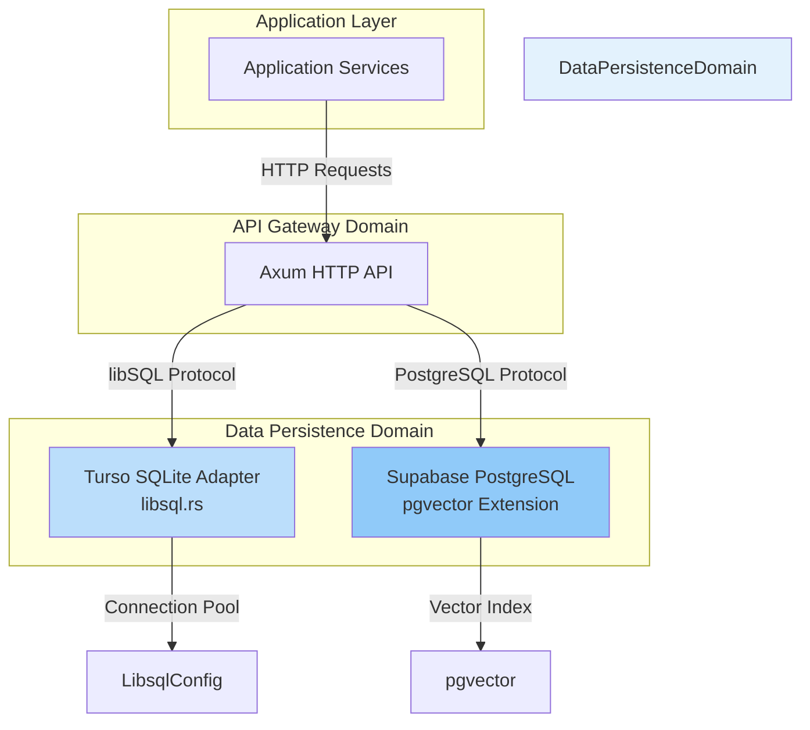
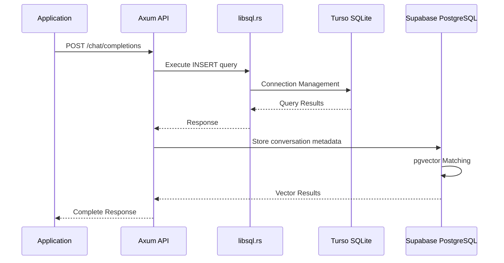
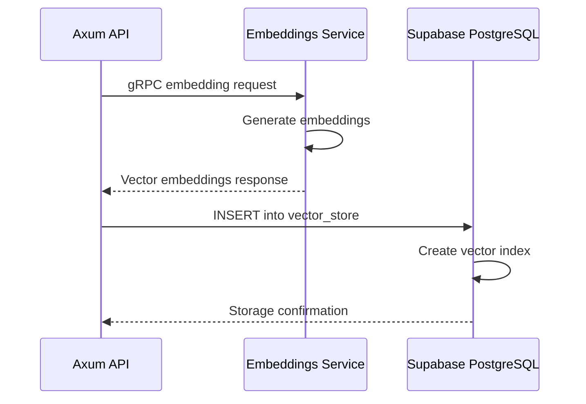
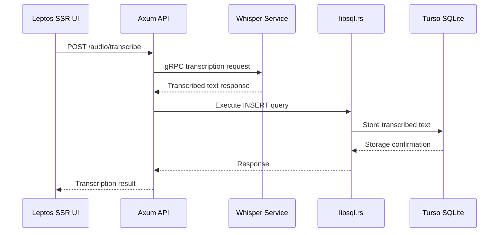

# Data Persistence Domain Technical Documentation

## 1. Domain Overview

The Data Persistence Domain in CowabungaAI implements a dual-database architecture strategy that separates application-level data from vector storage requirements. This domain is critical for maintaining data integrity, enabling efficient query operations, and supporting the core AI assistant functionality.

### 1.1 Domain Responsibilities

| Responsibility | Description |
|---------------|-------------|
| **Data Storage** | Persistent storage for conversation history, user sessions, API keys, and metadata |
| **Vector Search** | Semantic search capabilities using pgvector extension for embedding storage and retrieval |
| **Connection Management** | Database connection pooling, lifecycle management, and health monitoring |
| **Schema Evolution** | Migration management and version control for database schema changes |
| **Query Execution** | SQL query processing with validation and security controls |

### 1.2 Domain Architecture



## 2. Database Strategy

### 2.1 Dual-Database Architecture

The system employs a strategic separation of concerns between two database technologies:

| Database | Technology | Use Case | Characteristics |
|----------|-----------|----------|-----------------|
| **Turso** | libSQL/Turso (SQLite over network) | Application data, user sessions, API keys | Lightweight, embedded, ACID compliance |
| **Supabase** | PostgreSQL with pgvector | Vector embeddings, complex queries, authentication | Scalable, vector search, rich features |

### 2.2 Rationale for Dual-Database Approach

**Turso SQLite Selection:**
- **Lightweight Operations**: SQLite provides zero-configuration deployment for application-level data
- **Transaction Safety**: ACID compliance ensures data integrity for critical operations
- **Network Transparency**: libSQL protocol enables distributed SQLite instances
- **Simplicity**: Single database instance reduces operational complexity

**Supabase PostgreSQL Selection:**
- **Vector Search**: pgvector extension enables efficient similarity search
- **Scalability**: PostgreSQL handles high-concurrency workloads
- **Rich Ecosystem**: Mature PostgreSQL features for complex queries
- **Authentication**: Built-in user management and security features

## 3. Turso SQLite Adapter Implementation

### 3.1 Module Structure

The Turso adapter is implemented in Rust as part of the `db` crate:

```
rust/crates/db/
├── src/
│   ├── libsql.rs          # Main adapter implementation
│   ├── config.rs          # Configuration management
│   └── migrations/        # Schema migration files
```

### 3.2 Core Components

#### 3.2.1 LibsqlConfig Structure

```rust
pub struct LibsqlConfig {
    pub url: String,
    pub timeout: u64,
    pub max_connections: u32,
    pub enable_ssl: bool,
}
```

**Configuration Parameters:**
- `url`: Database connection string (libSQL protocol)
- `timeout`: Connection timeout in milliseconds
- `max_connections`: Maximum concurrent connections
- `enable_ssl`: Enable encrypted connections

#### 3.2.2 LibsqlStorage Implementation

The `LibsqlStorage` struct implements the `Storage` trait with async methods:

```rust
pub struct LibsqlStorage {
    pub client: LibsqlClient,
    pub config: LibsqlConfig,
}

impl Storage for LibsqlStorage {
    async fn execute_query(&self, query: &str) -> Result<QueryResult>;
    async fn execute_transaction(&self, operations: Vec<Operation>) -> Result<bool>;
    async fn health_check(&self) -> Result<HealthStatus>;
    async fn run_migrations(&self) -> Result<MigrationStatus>;
}
```

**Key Methods:**

| Method | Purpose | Return Type |
|--------|---------|-------------|
| `execute_query()` | Execute SQL queries with validation | `QueryResult` |
| `execute_transaction()` | Atomic multi-operation execution | `bool` |
| `health_check()` | Verify database connectivity | `HealthStatus` |
| `run_migrations()` | Apply schema migrations | `MigrationStatus` |

### 3.3 Connection Management

The adapter implements connection pooling to handle concurrent requests efficiently:

```rust
impl LibsqlStorage {
    pub async fn get_connection(&self) -> Result<DatabaseConnection> {
        let conn = self.client.acquire().await?;
        Ok(DatabaseConnection {
            conn,
            created_at: Instant::now(),
            last_used: Instant::now(),
        })
    }
}
```

**Connection Lifecycle:**
1. **Acquisition**: Request connection from pool
2. **Usage**: Execute queries within connection scope
3. **Release**: Return connection to pool automatically
4. **Timeout**: Automatic cleanup of stale connections

### 3.4 Health Check Implementation

```rust
pub struct HealthStatus {
    pub status: HealthStatusType,
    pub latency_ms: u64,
    pub last_check: DateTime<Utc>,
}

pub enum HealthStatusType {
    Healthy,
    Degraded,
    Unhealthy,
}
```

**Health Check Process:**
1. Execute lightweight query to verify connectivity
2. Measure response time
3. Return status with latency metrics
4. Log health check results for monitoring

## 4. Supabase PostgreSQL Integration

### 4.1 Module Structure

```
packages/api/supabase/
├── migrations/
│   ├── 20240419164109_v0.8.0_openai_types.sql
│   └── 20240502193159_v0.8.0_vector_stores.sql
├── schema/
│   └── pgvector_config.yaml
└── queries/
    └── vector_search.sql
```

### 4.2 Database Schema

#### 4.2.1 Core Tables

**assistant_objects Table:**
```sql
CREATE TABLE assistant_objects (
    id UUID PRIMARY KEY DEFAULT gen_random_uuid(),
    name VARCHAR(255) NOT NULL,
    description TEXT,
    created_at TIMESTAMP WITH TIME ZONE DEFAULT NOW(),
    updated_at TIMESTAMP WITH TIME ZONE DEFAULT NOW(),
    metadata JSONB DEFAULT '{}'::jsonb
);
```

**message_objects Table:**
```sql
CREATE TABLE message_objects (
    id UUID PRIMARY KEY DEFAULT gen_random_uuid(),
    assistant_id UUID REFERENCES assistant_objects(id),
    role VARCHAR(50) NOT NULL,
    content TEXT NOT NULL,
    created_at TIMESTAMP WITH TIME ZONE DEFAULT NOW(),
    metadata JSONB DEFAULT '{}'::jsonb
);
```

**run_objects Table:**
```sql
CREATE TABLE run_objects (
    id UUID PRIMARY KEY DEFAULT gen_random_uuid(),
    assistant_id UUID REFERENCES assistant_objects(id),
    status VARCHAR(50) NOT NULL,
    created_at TIMESTAMP WITH TIME ZONE DEFAULT NOW(),
    completed_at TIMESTAMP WITH TIME ZONE,
    metadata JSONB DEFAULT '{}'::jsonb
);
```

#### 4.2.2 Vector Store Tables

**vector_store Table:**
```sql
CREATE TABLE vector_store (
    id UUID PRIMARY KEY DEFAULT gen_random_uuid(),
    name VARCHAR(255) NOT NULL,
    description TEXT,
    embedding_dimension INTEGER NOT NULL,
    created_at TIMESTAMP WITH TIME ZONE DEFAULT NOW(),
    updated_at TIMESTAMP WITH TIME ZONE DEFAULT NOW()
);
```

**file_usage_tracking Table:**
```sql
CREATE TABLE file_usage_tracking (
    id UUID PRIMARY KEY DEFAULT gen_random_uuid(),
    vector_store_id UUID REFERENCES vector_store(id),
    file_path VARCHAR(500) NOT NULL,
    embedding_vector VECTOR(1536),
    usage_count INTEGER DEFAULT 0,
    created_at TIMESTAMP WITH TIME ZONE DEFAULT NOW()
);
```

### 4.3 pgvector Extension Integration

#### 4.3.1 Vector Index Creation

```sql
CREATE INDEX ON vector_store USING ivfflat (embedding_vector vector_cosine_ops)
    WITH (lists = 100);
```

**Index Configuration:**
- **Index Type**: Inverted File Flat (IVFFlat)
- **Distance Metric**: Cosine similarity
- **List Count**: 100 partitions for efficient search

#### 4.3.2 Vector Search Function

```sql
CREATE OR REPLACE FUNCTION match_vectors(
    query_vector VECTOR(1536),
    top_k INTEGER DEFAULT 10
) RETURNS TABLE (
    id UUID,
    name VARCHAR(255),
    similarity FLOAT
) AS $$
BEGIN
    RETURN QUERY
    SELECT 
        fs.id,
        fs.name,
        1 - (fs.embedding_vector <=> query_vector) AS similarity
    FROM vector_store fs
    ORDER BY fs.embedding_vector <=> query_vector
    LIMIT top_k;
END;
$$ LANGUAGE plpgsql;
```

**Function Parameters:**
- `query_vector`: Input vector for similarity search
- `top_k`: Number of results to return (default: 10)

**Return Values:**
- `id`: Vector store identifier
- `name`: Vector store name
- `similarity`: Cosine similarity score (0.0 to 1.0)

### 4.4 Triggers for Embedding Management

```sql
CREATE OR REPLACE FUNCTION update_vector_store_timestamps()
RETURNS TRIGGER AS $$
BEGIN
    NEW.updated_at = NOW();
    RETURN NEW;
END;
$$ LANGUAGE plpgsql;

CREATE TRIGGER vector_store_timestamps_trigger
    BEFORE UPDATE ON vector_store
    FOR EACH ROW
    EXECUTE FUNCTION update_vector_store_timestamps();
```

**Trigger Purpose:**
- Automatically update `updated_at` timestamp on record modifications
- Maintain data freshness for audit purposes

## 5. Data Models and Interfaces

### 5.1 QueryRequest Model

```rust
#[derive(Debug, Serialize, Deserialize)]
pub struct QueryRequest {
    pub query: String,
    pub database: DatabaseType,
    pub parameters: Option<QueryParameters>,
}

#[derive(Debug, Serialize, Deserialize)]
pub struct QueryParameters {
    pub limit: Option<u32>,
    pub offset: Option<u32>,
    pub filters: Option<FilterExpression>,
}
```

**Model Components:**
- `query`: SQL query string with validation
- `database`: Target database type (Turso/Supabase)
- `parameters`: Optional query parameters for filtering and pagination

### 5.2 Response Models

```rust
#[derive(Debug, Serialize, Deserialize)]
pub struct QueryResult {
    pub success: bool,
    pub data: Option<serde_json::Value>,
    pub error: Option<String>,
    pub metadata: QueryMetadata,
}

#[derive(Debug, Serialize, Deserialize)]
pub struct QueryMetadata {
    pub execution_time_ms: u64,
    pub rows_affected: u64,
    pub database: DatabaseType,
}
```

### 5.3 API Endpoints

#### 5.3.1 Query Execution Endpoint

```
POST /api/v1/queries
Content-Type: application/json

{
    "query": "SELECT * FROM message_objects WHERE assistant_id = $1",
    "database": "turso",
    "parameters": {
        "limit": 100,
        "offset": 0
    }
}
```

**Response:**
```json
{
    "success": true,
    "data": [...],
    "metadata": {
        "execution_time_ms": 45,
        "rows_affected": 100,
        "database": "turso"
    }
}
```

#### 5.3.2 Vector Search Endpoint

```
POST /api/v1/vector-search
Content-Type: application/json

{
    "query_vector": [0.1, 0.2, 0.3, ...],
    "top_k": 10,
    "database": "supabase"
}
```

**Response:**
```json
{
    "success": true,
    "data": [
        {
            "id": "uuid-1",
            "name": "vector-store-1",
            "similarity": 0.95
        }
    ],
    "metadata": {
        "execution_time_ms": 12,
        "rows_affected": 10,
        "database": "supabase"
    }
}
```

#### 5.3.3 Health Check Endpoint

```
GET /api/v1/health/database
```

**Response:**
```json
{
    "status": "healthy",
    "databases": {
        "turso": {
            "status": "healthy",
            "latency_ms": 12
        },
        "supabase": {
            "status": "healthy",
            "latency_ms": 8
        }
    },
    "timestamp": "2024-05-15T10:30:00Z"
}
```

## 6. Key Operations and Workflows

### 6.1 Chat Completion Persistence Flow



**Steps:**
1. **Request Reception**: API receives chat completion request
2. **Query Execution**: libsql adapter executes SQL INSERT for conversation data
3. **Connection Management**: Turso manages database connection lifecycle
4. **Vector Storage**: Supabase stores conversation metadata with embeddings
5. **Response Return**: Complete response sent to client

### 6.2 Text Embedding Storage Flow



**Steps:**
1. **Embedding Generation**: Text embeddings service processes input text
2. **Vector Creation**: Generate vector representation using InstructorEmbedding
3. **Storage**: Insert vector into Supabase vector_store table
4. **Index Creation**: Update vector index for efficient search
5. **Confirmation**: Return storage success to API

### 6.3 Audio Transcription Persistence Flow



**Steps:**
1. **Upload Reception**: UI submits audio file through web interface
2. **Transcription**: Whisper model converts audio to text
3. **Data Persistence**: libsql adapter stores transcribed text and metadata
4. **Connection Management**: Turso handles connection lifecycle
5. **Response Return**: Transcription result sent to client

## 7. Configuration and Deployment

### 7.1 Turso Configuration

**Configuration File Location:**
```
bundles/dev/cpu/uds-config.yaml
bundles/latest/cpu/uds-bundle.yaml
```

**Configuration Parameters:**
```yaml
database:
  turso:
    url: "libsql://your-instance.turso.io"
    timeout_ms: 5000
    max_connections: 20
    enable_ssl: true
  supabase:
    url: "postgresql://your-supabase-url"
    pool_size: 10
    enable_ssl: true
```

### 7.2 Migration Management

**Migration File Structure:**
```
packages/api/supabase/migrations/
├── 20240419164109_v0.8.0_openai_types.sql
├── 20240502193159_v0.8.0_vector_stores.sql
└── [timestamp]_[version].sql
```

**Migration Execution:**
```rust
pub async fn run_migrations(&self) -> Result<MigrationStatus> {
    let migrations = self.get_pending_migrations()?;
    for migration in migrations {
        self.apply_migration(&migration).await?;
    }
    Ok(MigrationStatus {
        success: true,
        applied_count: migrations.len(),
    })
}
```

**Migration Status:**
- `success`: Boolean indicating migration completion
- `applied_count`: Number of migrations successfully applied
- `failed_migrations`: List of failed migration files

### 7.3 Kubernetes Deployment Configuration

**Deployment Manifest:**
```yaml
apiVersion: apps/v1
kind: Deployment
metadata:
  name: cowabungaai-db
spec:
  replicas: 1
  selector:
    matchLabels:
      app: cowabungaai-db
  template:
    metadata:
      labels:
        app: cowabungaai-db
    spec:
      containers:
      - name: db-adapter
        image: cowabungaai/db-adapter:latest
        env:
        - name: TURSO_URL
          valueFrom:
            secretKeyRef:
              name: db-secrets
              key: turso-url
        - name: SUPABASE_URL
          valueFrom:
            secretKeyRef:
              name: db-secrets
              key: supabase-url
        resources:
          requests:
            memory: "256Mi"
            cpu: "250m"
          limits:
            memory: "512Mi"
            cpu: "500m"
```

## 8. Best Practices and Considerations

### 8.1 Security Considerations

**SQL Injection Prevention:**
- Use parameterized queries exclusively
- Validate all query parameters before execution
- Implement query whitelist for allowed operations

**Connection Security:**
- Enable SSL/TLS for all database connections
- Use environment variables for sensitive credentials
- Implement connection timeout and retry logic

**Access Control:**
- Implement role-based access control for database operations
- Log all database access for audit purposes
- Restrict administrative operations to authorized users

### 8.2 Performance Optimization

**Connection Pooling:**
- Configure appropriate pool size based on workload
- Implement connection timeout and idle timeout
- Monitor connection utilization metrics

**Query Optimization:**
- Use EXPLAIN ANALYZE for query performance analysis
- Create appropriate indexes for frequently queried columns
- Implement query result caching for read-heavy operations

**Vector Search Optimization:**
- Configure IVFFlat index parameters based on dataset size
- Use approximate nearest neighbor search for large datasets
- Implement result pagination for large result sets

### 8.3 Monitoring and Observability

**Health Metrics:**
- Track database connection pool utilization
- Monitor query execution time and latency
- Log error rates and failure patterns

**Alerting Configuration:**
- Set up alerts for connection pool exhaustion
- Configure latency threshold alerts
- Implement database size monitoring

**Logging Strategy:**
- Log query execution with sanitized data
- Track migration execution and failures
- Record health check results with timestamps

### 8.4 Scalability Considerations

**Horizontal Scaling:**
- Turso supports distributed SQLite instances
- Supabase PostgreSQL can scale read replicas
- Implement read/write separation for high-traffic scenarios

**Data Partitioning:**
- Consider table partitioning for large datasets
- Implement sharding strategies for horizontal scaling
- Use materialized views for complex query optimization

**Backup and Recovery:**
- Implement automated backup schedules
- Test recovery procedures regularly
- Maintain point-in-time recovery capabilities

## 9. Troubleshooting Guide

### 9.1 Common Issues and Solutions

**Issue: Connection Timeout**
```
Error: Connection timeout after 5000ms
```
**Solution:**
1. Check network connectivity to database
2. Increase timeout value in configuration
3. Verify database server availability
4. Check firewall rules and network policies

**Issue: Query Execution Failure**
```
Error: SQL syntax error near 'SELECT'
```
**Solution:**
1. Validate SQL syntax using EXPLAIN
2. Check database schema compatibility
3. Review query parameter values
4. Enable detailed error logging

**Issue: Vector Search Performance Degradation**
```
Error: Vector search taking >1000ms
```
**Solution:**
1. Rebuild vector index with appropriate parameters
2. Check index statistics and fragmentation
3. Increase IVFFlat list count
4. Consider upgrading to HNSW index type

### 9.2 Diagnostic Commands

**Turso Connection Test:**
```bash
curl -X GET "http://localhost:8080/api/v1/health/database?db=turso"
```

**Supabase Health Check:**
```bash
curl -X GET "http://localhost:8080/api/v1/health/database?db=supabase"
```

**Query Performance Analysis:**
```sql
EXPLAIN ANALYZE 
SELECT * FROM message_objects 
WHERE assistant_id = 'uuid-123' 
ORDER BY created_at DESC 
LIMIT 100;
```

## 10. Conclusion

The Data Persistence Domain in CowabungaAI provides a robust foundation for data storage and retrieval through a carefully designed dual-database architecture. The Turso SQLite adapter handles application-level data with lightweight operations and ACID compliance, while the Supabase PostgreSQL integration enables advanced vector search capabilities through the pgvector extension.

**Key Strengths:**
- **Separation of Concerns**: Clear division between application data and vector storage
- **Scalability**: PostgreSQL supports horizontal scaling for vector search workloads
- **Security**: Comprehensive security measures including SSL, parameterized queries, and access control
- **Maintainability**: Well-structured migrations and health monitoring
- **Performance**: Optimized connection pooling and query execution

**Future Enhancements:**
- Implement connection pooling with automatic failover
- Add query result caching layer
- Enhance monitoring with distributed tracing
- Consider read replica implementation for high-traffic scenarios

This domain architecture successfully balances operational simplicity with advanced capabilities, providing a solid foundation for the AI assistant platform's data persistence requirements.