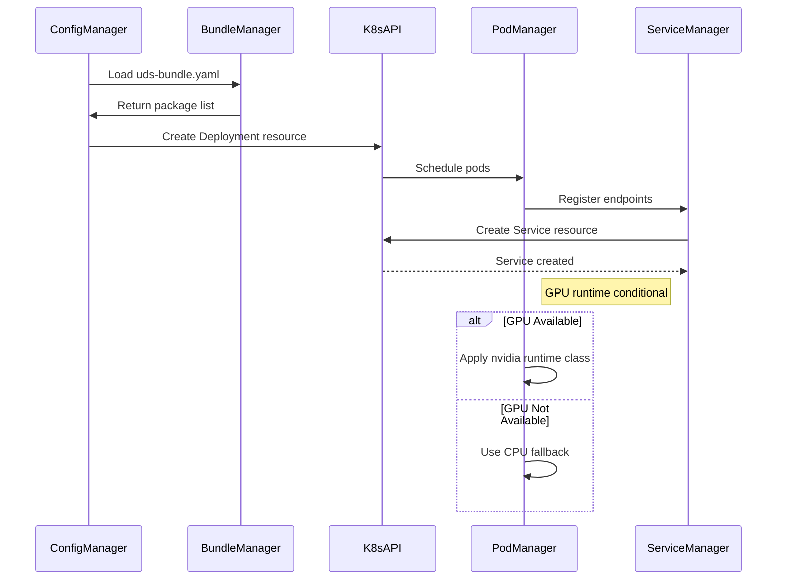
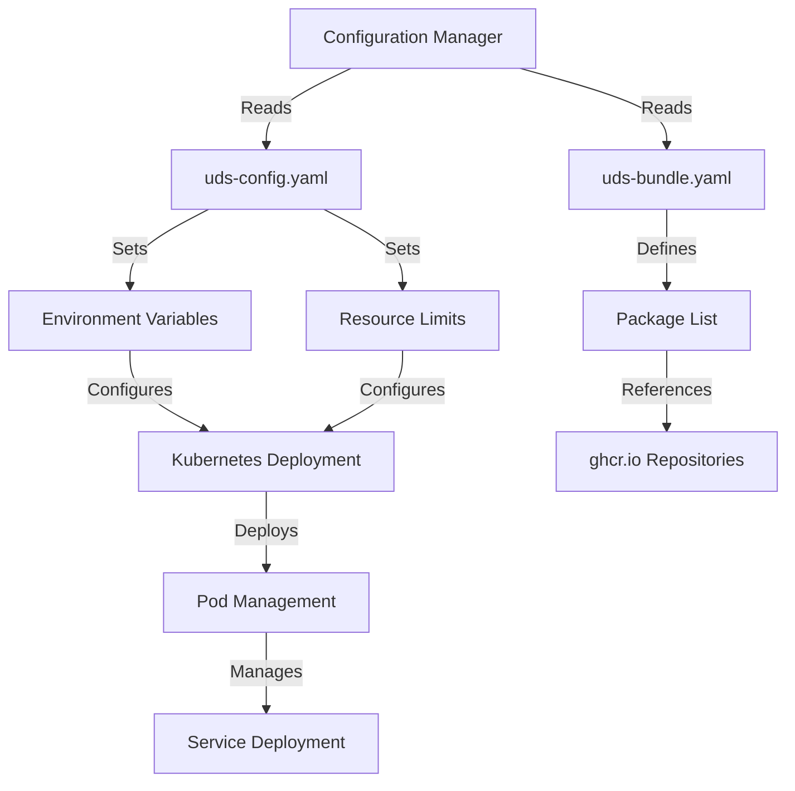
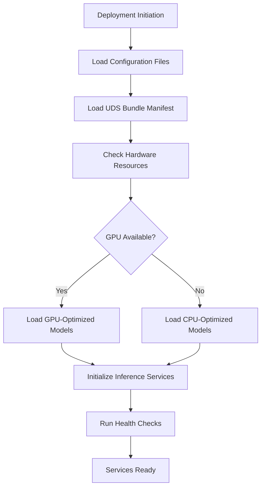

# Infrastructure Domain Technical Documentation

## 1. Overview

The Infrastructure Domain in CowabungaAI provides the foundational deployment and orchestration capabilities for the entire microservices architecture. This domain manages containerized service deployment, resource allocation, and environment configuration across CPU and GPU hardware configurations. It serves as the bridge between application code and production infrastructure, enabling flexible, scalable deployment strategies.

### 1.1 Domain Purpose

The Infrastructure Domain addresses three critical operational requirements:

1. **Container Orchestration**: Manages Kubernetes-based deployment of all microservices
2. **Configuration Management**: Provides environment-specific settings for runtime behavior
3. **Resource Allocation**: Handles GPU/CPU resource configuration and fallback strategies

### 1.2 Domain Boundaries

| Included Components | Excluded Components |
|---------------------|---------------------|
| Kubernetes deployment manifests | Production Kubernetes cluster infrastructure |
| Helm chart templates | CI/CD pipeline systems |
| Configuration management files | External LLM provider APIs |
| GPU runtime configuration | Third-party vector database services |
| Package deployment orchestration | External audio processing services |

---

## 2. Architecture

### 2.1 Domain Structure

```
Infrastructure Domain
├── Kubernetes Deployment Manager
│   ├── Helm Chart Templates
│   │   ├── packages/api/chart/templates/deployment.yaml
│   │   ├── packages/llama-cpp-python/chart/templates/deployment.yaml
│   │   ├── packages/ui/chart/templates/deployment.yaml
│   │   ├── packages/text-embeddings/chart/templates/deployment.yaml
│   │   └── packages/whisper/chart/templates/deployment.yaml
│   └── Pod Management
│
└── Configuration Manager
    ├── Runtime Configuration
    │   ├── bundles/dev/cpu/uds-config.yaml
    │   ├── bundles/dev/gpu/uds-config.yaml
    │   ├── bundles/latest/cpu/uds-config.yaml
    │   └── bundles/latest/gpu/uds-config.yaml
    └── Deployment Bundles
        ├── bundles/dev/cpu/uds-bundle.yaml
        └── bundles/latest/cpu/uds-bundle.yaml
```

### 2.2 External System Integration

The Infrastructure Domain integrates with the following external systems:

| System | Type | Interaction | Purpose |
|--------|------|-------------|---------|
| Kubernetes/K3d | Orchestration | Container API | Service deployment and lifecycle management |
| NVIDIA GPU Runtime | Infrastructure | CUDA | GPU acceleration for inference services |
| ghcr.io | Container Registry | HTTP | Pull container images for API and LLM components |

---

## 3. Kubernetes Deployment Manager

### 3.1 Deployment Strategy

The Kubernetes Deployment Manager implements Helm chart templates with conditional blocks for strategy configuration. Each service deployment follows a standardized pattern:

```yaml
# Deployment Template Structure
apiVersion: apps/v1
kind: Deployment
metadata:
  name: <service-name>
  labels:
    app: <service-name>
    domain: infrastructure
spec:
  replicas: <replica-count>
  selector:
    matchLabels:
      app: <service-name>
  template:
    metadata:
      labels:
        app: <service-name>
    spec:
      containers:
      - name: <service-name>
        image: <image-registry>/<image-name>:<tag>
        resources:
          limits:
            cpu: "<cpu-limit>"
            memory: "<memory-limit>"
            nvidia.com/gpu: "<gpu-count>"
          requests:
            cpu: "<cpu-request>"
            memory: "<memory-request>"
```

### 3.2 Service-Specific Deployments

#### 3.2.1 API Service Deployment

The API service deployment manages the Axum-based HTTP API gateway:

```yaml
# packages/api/chart/templates/deployment.yaml
apiVersion: apps/v1
kind: Deployment
metadata:
  name: cowabunga-api
spec:
  replicas: 2
  template:
    spec:
      containers:
      - name: api
        image: ghcr.io/cowabungaai/api:latest
        ports:
        - containerPort: 8080
        env:
        - name: DATABASE_URL
          valueFrom:
            secretKeyRef:
              name: cowabunga-secrets
              key: database-url
        - name: GRPC_BACKEND_URL
          value: "grpc://llm-service:50051"
```

#### 3.2.2 LLM Service Deployment

The LLM service deployment supports both CPU and GPU configurations:

```yaml
# packages/llama-cpp-python/chart/templates/deployment.yaml
apiVersion: apps/v1
kind: Deployment
metadata:
  name: cowabunga-llm
spec:
  replicas: 1
  template:
    spec:
      containers:
      - name: llama-cpp
        image: ghcr.io/cowabungaai/llama-cpp-python:latest
        resources:
          limits:
            nvidia.com/gpu: "1"
          requests:
            nvidia.com/gpu: "1"
        env:
        - name: CUDA_VISIBLE_DEVICES
          value: "0"
```

### 3.3 Pod Management

Pod management handles the following lifecycle operations:

1. **Pod Scheduling**: Kubernetes API schedules pods based on resource availability
2. **Replica Management**: Maintains desired replica counts for high availability
3. **Health Probes**: Implements liveness and readiness probes
4. **Update Strategies**: Supports rolling updates with zero downtime



---

## 4. Configuration Manager

### 4.1 Configuration File Structure

The Configuration Manager uses YAML-based configuration files organized by environment and hardware type:

```
bundles/
├── dev/
│   ├── cpu/
│   │   ├── uds-config.yaml
│   │   └── uds-bundle.yaml
│   └── gpu/
│       ├── uds-config.yaml
│       └── uds-bundle.yaml
└── latest/
    ├── cpu/
    │   ├── uds-config.yaml
    │   └── uds-bundle.yaml
    └── gpu/
        ├── uds-config.yaml
        └── uds-bundle.yaml
```

### 4.2 Runtime Configuration (uds-config.yaml)

The `uds-config.yaml` file defines runtime environment variables and resource limits:

```yaml
# bundles/dev/cpu/uds-config.yaml
runtime:
  environment:
    - name: NODE_ENV
      value: "development"
    - name: LOG_LEVEL
      value: "debug"
    - name: DATABASE_URL
      value: "libsql://localhost:8080"
    - name: GRPC_BACKEND_URL
      value: "grpc://localhost:50051"
  resource_limits:
    cpu:
      limit: "2000m"
      request: "1000m"
    memory:
      limit: "4Gi"
      request: "2Gi"
    gpu:
      limit: "0"
      request: "0"
```

### 4.3 Deployment Bundle (uds-bundle.yaml)

The `uds-bundle.yaml` file defines the deployment package list and metadata:

```yaml
# bundles/latest/cpu/uds-bundle.yaml
uds_bundle:
  version: "1.0.0"
  environment: "production"
  hardware: "cpu"
packages:
  - name: api
    image: "ghcr.io/cowabungaai/api:latest"
    port: 8080
  - name: llama-cpp-python
    image: "ghcr.io/cowabungaai/llama-cpp-python:latest"
    port: 50051
  - name: text-embeddings
    image: "ghcr.io/cowabungaai/text-embeddings:latest"
    port: 50052
  - name: whisper
    image: "ghcr.io/cowabungaai/whisper:latest"
    port: 50053
  - name: ui
    image: "ghcr.io/cowabungaai/ui:latest"
    port: 3000
```

### 4.4 GPU Configuration

GPU configuration enables conditional GPU runtime class application:

```yaml
# bundles/latest/gpu/uds-config.yaml
runtime:
  environment:
    - name: CUDA_VISIBLE_DEVICES
      value: "0,1"
    - name: GPU_MEMORY_FRACTION
      value: "0.8"
  resource_limits:
    gpu:
      limit: "2"
      request: "2"
      runtime_class: "nvidia"
```

---

## 5. Deployment Patterns

### 5.1 CPU Fallback Strategy

The system implements a CPU fallback strategy when GPU resources are unavailable:

```yaml
# Conditional GPU Configuration
resources:
  limits:
    cpu: "4000m"
    memory: "8Gi"
    nvidia.com/gpu: "0"  # Zero GPU limit for CPU fallback
  requests:
    cpu: "2000m"
    memory: "4Gi"
    nvidia.com/gpu: "0"
```

This pattern ensures service availability even when GPU resources are not provisioned, with automatic fallback to CPU-based inference.

### 5.2 Environment-Specific Deployments

The system supports multiple deployment environments:

| Environment | Configuration | Use Case |
|-------------|---------------|----------|
| Development | `bundles/dev/cpu/` | Local development and testing |
| Production CPU | `bundles/latest/cpu/` | CPU-only production deployments |
| Production GPU | `bundles/latest/gpu/` | GPU-accelerated production deployments |

### 5.3 Service Communication

Services communicate through defined labels and selectors:

```yaml
# Service Definition
apiVersion: v1
kind: Service
metadata:
  name: cowabunga-api
spec:
  selector:
    app: cowabunga-api
  ports:
  - protocol: TCP
    port: 8080
    targetPort: 8080
  type: ClusterIP
```

---

## 6. Integration with Other Domains

### 6.1 Configuration Dependency

The Infrastructure Domain provides configuration dependencies for other domains:



### 6.2 Domain Relationships

| Source Domain | Target Domain | Relation Type | Strength |
|---------------|---------------|---------------|----------|
| Infrastructure Domain | API Gateway Domain | Configuration Dependency | 6.0 |
| Infrastructure Domain | AI Inference Domain | Configuration Dependency | 6.0 |

---

## 7. Implementation Details

### 7.1 Helm Chart Templates

Helm chart templates implement conditional blocks for strategy configuration:

```yaml
# Conditional Deployment Strategy
{{- if .Values.gpu.enabled }}
resources:
  limits:
    nvidia.com/gpu: "{{ .Values.gpu.count }}"
{{- else }}
resources:
  limits:
    nvidia.com/gpu: "0"
{{- end }}
```

### 7.2 External Repository Integration

The deployment system references external container repositories:

```yaml
# ghcr.io Repository Reference
image: ghcr.io/cowabungaai/<service-name>:<version>
```

### 7.3 Package List Management

The bundle structure defines UDSBundle metadata with package lists for deployment orchestration:

```yaml
# Package List Structure
packages:
  - name: <service-name>
    image: <image-registry>/<image-name>:<tag>
    port: <port-number>
    resources:
      cpu: <cpu-requirements>
      memory: <memory-requirements>
      gpu: <gpu-requirements>
```

---

## 8. Operational Considerations

### 8.1 Health Checks

Health check endpoints are implemented for all services:

```yaml
# Health Check Configuration
livenessProbe:
  httpGet:
    path: /health
    port: 8080
  initialDelaySeconds: 10
  periodSeconds: 30
readinessProbe:
  httpGet:
    path: /ready
    port: 8080
  initialDelaySeconds: 5
  periodSeconds: 10
```

### 8.2 Resource Management

Resource limits and requests are configured to prevent resource exhaustion:

| Resource | Limit | Request | Purpose |
|----------|-------|---------|---------|
| CPU | 4000m | 2000m | Prevent overcommitment |
| Memory | 8Gi | 4Gi | Ensure adequate memory |
| GPU | 2 | 2 | GPU resource allocation |

### 8.3 Update Strategies

Rolling updates maintain service availability:

```yaml
# Rolling Update Strategy
strategy:
  type: RollingUpdate
  rollingUpdate:
    maxSurge: 1
    maxUnavailable: 0
```

---

## 9. Deployment Workflow

### 9.1 Model Management and Deployment Flow

The deployment workflow manages AI inference model deployment across hardware configurations:



### 9.2 Deployment Steps

| Step | Component | Operation | Purpose |
|------|-----------|-----------|---------|
| 1 | Infrastructure Domain | Load uds-config.yaml and uds-bundle.yaml | Read deployment configuration |
| 2 | Infrastructure Domain | Check hardware resources (GPU/CPU) | Determine available compute resources |
| 3 | AI Inference Domain | Initialize appropriate model backends | Load llama-cpp-python or vLLM based on hardware |
| 4 | AI Inference Domain | Run health checks and readiness probes | Verify service availability |

---

## 10. Best Practices

### 10.1 Configuration Management

1. **Environment Separation**: Maintain separate configuration files for development and production
2. **Hardware-Aware Configurations**: Create distinct configurations for CPU and GPU environments
3. **Version Control**: Track configuration changes in version control systems

### 10.2 Resource Allocation

1. **Conservative Limits**: Set resource limits to prevent overcommitment
2. **GPU Fallback**: Implement zero GPU limits for CPU fallback scenarios
3. **Monitoring**: Monitor resource utilization and adjust limits accordingly

### 10.3 Deployment Strategy

1. **Rolling Updates**: Use rolling updates to maintain service availability
2. **Health Checks**: Implement comprehensive health check endpoints
3. **Graceful Degradation**: Support fallback to CPU when GPU unavailable

---

## 11. Troubleshooting

### 11.1 Common Issues

| Issue | Symptom | Resolution |
|-------|---------|------------|
| GPU Not Available | Service fails to start on GPU | Verify GPU runtime class and driver installation |
| Resource Exhaustion | Pods evicted due to OOM | Increase memory limits or reduce replica count |
| Image Pull Failures | Container image not found | Verify ghcr.io repository access and image tags |

### 11.2 Debugging Commands

```bash
# Check pod status
kubectl get pods -n cowabunga

# View pod logs
kubectl logs <pod-name> -n cowabunga

# Check resource usage
kubectl top pods -n cowabunga

# Describe pod events
kubectl describe pod <pod-name> -n cowabunga
```

---

## 12. Conclusion

The Infrastructure Domain provides essential deployment and orchestration capabilities for the CowabungaAI microservices architecture. Through Kubernetes-based deployment management and comprehensive configuration handling, it enables flexible, scalable deployment across CPU and GPU environments. The domain's design emphasizes reliability through CPU fallback strategies, resource management, and health monitoring, ensuring consistent service availability regardless of hardware configuration.

**Key Strengths:**
- Clear separation between deployment configuration and application code
- Flexible CPU/GPU support with automatic fallback
- Standardized Helm chart templates for consistent deployments
- Comprehensive resource management and health monitoring

**Areas for Enhancement:**
- Enhanced monitoring and observability integration
- Automated configuration validation
- Improved documentation for deployment procedures

The Infrastructure Domain successfully balances operational complexity with maintainability, providing a solid foundation for enterprise AI application deployment while remaining accessible for development and production operations.