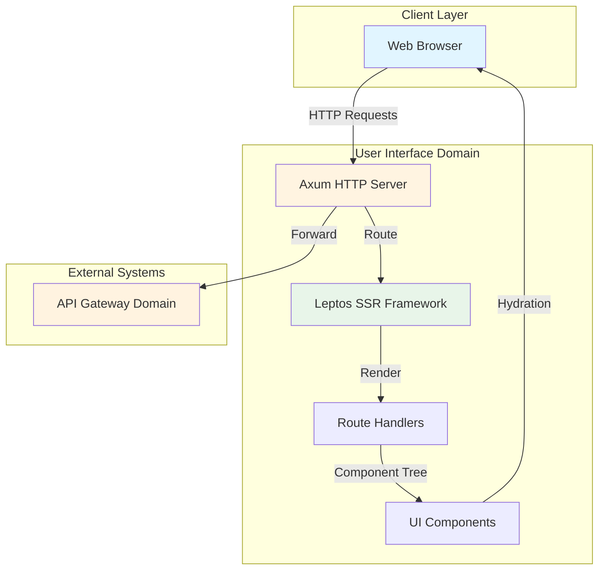
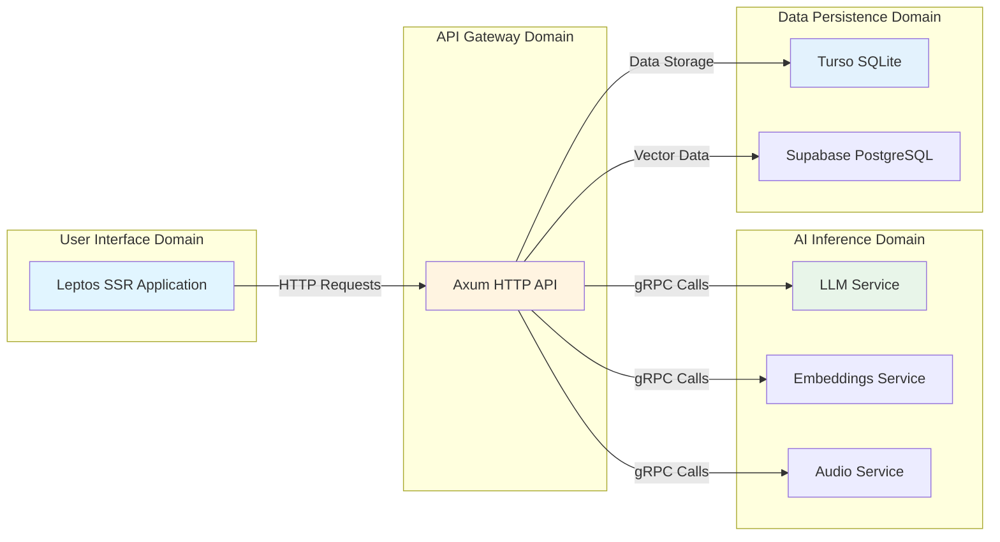
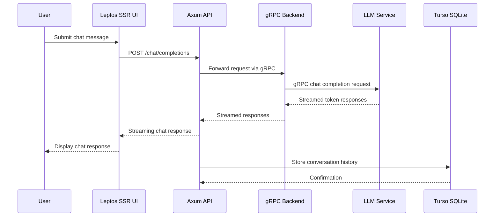

# User Interface Domain Technical Documentation

## 1. Domain Overview

### 1.1 Domain Purpose

The User Interface Domain serves as the primary interaction layer for CowabungaAI, providing a server-side rendered (SSR) web interface that enables end users to interact with AI capabilities including chat completion, file uploads, and conversation management. This domain acts as the entry point for all user-facing operations, orchestrating requests through the API Gateway Domain to backend services.

### 1.2 Domain Classification

| Attribute | Value |
|-----------|-------|
| **Domain Type** | Core Business Domain |
| **Importance Score** | 8.0/10 |
| **Complexity Score** | 6.0/10 |
| **Primary Technology** | Leptos SSR Framework |
| **Entry Point** | `/rust/crates/ui/src/main.rs` |

### 1.3 Domain Boundaries

**Included Components:**
- Leptos SSR web application
- Axum HTTP server integration
- Client-side hydration logic
- Reactive state management
- File upload handling
- Conversation history display

**Excluded Components:**
- AI inference logic (handled by AI Inference Domain)
- API routing and validation (handled by API Gateway Domain)
- Data persistence operations (handled by Data Persistence Domain)

---

## 2. Architecture and Technology Stack

### 2.1 Framework Selection

The User Interface Domain leverages **Leptos**, a modern Rust web framework that combines server-side rendering with client-side interactivity. Leptos provides:

- **Server-Side Rendering (SSR)**: Optimizes initial page load performance by rendering HTML on the server
- **Client-Side Hydration**: Enables interactive UI after initial load without full JavaScript bundle
- **Reactive State Management**: Built-in reactive system for efficient component updates
- **TypeScript/JavaScript Interop**: Seamless integration with modern web development practices

### 2.2 Server Integration

The UI integrates with **Axum**, Rust's modular web framework, which provides:

- HTTP request handling
- Routing configuration
- Middleware support
- Streaming response capabilities

### 2.3 Technology Stack Diagram



---

## 3. Module Structure and Code Organization

### 3.1 Directory Structure

```
rust/crates/ui/
├── Cargo.toml              # Dependencies and build configuration
├── src/
│   ├── main.rs             # Application entry point
│   └── app.rs              # Main application logic and components
└── static/                 # Static assets (if any)
```

### 3.2 Entry Point Implementation

**File**: `rust/crates/ui/src/main.rs`

The `main.rs` file serves as the application entry point with the following responsibilities:

1. **Axum Server Initialization**: Configures the HTTP server with middleware and routes
2. **Leptos Integration**: Sets up the SSR application context
3. **Environment Configuration**: Loads environment variables for deployment settings
4. **Health Check Endpoint**: Provides service availability verification

```rust
// Key implementation patterns:
- Axum::new().serve(listener)
- Leptos::configure_routes()
- Environment variable loading via dotenv
- Health check route registration
```

### 3.3 Application Logic Implementation

**File**: `rust/crates/ui/src/app.rs`

The `app.rs` file contains the core application logic:

1. **Root Component Definition**: Defines the main application view structure
2. **Route Handlers**: Implements navigation and page transitions
3. **State Management**: Manages reactive state for UI components
4. **Component Composition**: Builds UI from reusable components

```rust
// Key implementation patterns:
- Leptos::component() for root view
- Reactive state with Leptos::create_signal()
- Conditional rendering with Leptos::if_signal()
- Event handlers for user interactions
```

---

## 4. Key Functions and Capabilities

### 4.1 Chat Interface Rendering

The UI provides a real-time chat interface with the following capabilities:

| Feature | Description | Implementation |
|---------|-------------|----------------|
| **Message Display** | Renders user and AI messages with timestamps | Leptos component tree |
| **Streaming Support** | Displays partial responses as tokens arrive | Server-sent events integration |
| **Markdown Rendering** | Formats AI responses with markdown support | External markdown parser |
| **Scroll Management** | Auto-scrolls to latest message | DOM manipulation |

### 4.2 Conversation History Management

The UI manages conversation history with the following features:

- **History Display**: Shows previous conversations with metadata
- **Conversation Selection**: Allows users to switch between conversations
- **History Persistence**: Syncs with backend via API calls
- **Local Storage**: Caches recent conversations for offline access

### 4.3 File Upload Handling

The UI supports file uploads with the following capabilities:

| File Type | Supported Formats | Processing |
|-----------|-------------------|------------|
| **Audio** | MP3, WAV, M4A | Upload to API Gateway |
| **Documents** | PDF, TXT, MD | Upload to API Gateway |
| **Images** | JPG, PNG, GIF | Upload to API Gateway |

**Upload Flow:**
1. User selects file via file picker
2. UI validates file type and size
3. File uploaded via HTTP POST to API Gateway
4. Upload progress displayed to user
5. Transcription/embedding processing initiated

### 4.4 User Authentication

The UI implements authentication through:

- **API Key Management**: Displays and manages API keys
- **Session Persistence**: Maintains authentication state
- **Token Refresh**: Handles token expiration gracefully
- **Security Headers**: Implements appropriate security headers

---

## 5. Integration with Other Domains

### 5.1 Domain Relations



### 5.2 Communication Patterns

**HTTP Communication:**
- **Protocol**: HTTP/1.1 or HTTP/2
- **Method**: RESTful API calls
- **Content Type**: `application/json`
- **Authentication**: API key in headers

**gRPC Communication:**
- **Protocol**: gRPC over HTTP/2
- **Services**: Chat Completion, Embeddings, Audio
- **Streaming**: Server-sent events for chat responses

### 5.3 Data Flow Patterns



---

## 6. Business Flows Involving UI

### 6.1 Chat Completion Flow

**Importance**: 9.5/10

**UI Responsibilities:**
1. Capture user input via text field
2. Submit chat request to API Gateway
3. Display streaming response tokens
4. Store conversation history locally
5. Manage conversation state

**Key Implementation Details:**
- Input validation before submission
- Loading state during API calls
- Error handling for failed requests
- Auto-scroll to latest message

### 6.2 Audio Transcription Flow

**Importance**: 7.5/10

**UI Responsibilities:**
1. Provide file upload interface
2. Validate file type and size
3. Display upload progress
4. Show transcription results
5. Manage audio file metadata

**Key Implementation Details:**
- File type validation (MP3, WAV, M4A)
- Size limit enforcement
- Progress bar during upload
- Transcription result display

### 6.3 Text Embedding Generation Flow

**Importance**: 8.0/10

**UI Responsibilities:**
1. Provide text input field
2. Submit text for embedding generation
3. Display embedding results
4. Manage embedding metadata

**Key Implementation Details:**
- Text length validation
- Character encoding handling
- Embedding result formatting
- Metadata display

---

## 7. Implementation Details

### 7.1 Server-Side Rendering Implementation

**Benefits:**
- **Faster Initial Load**: HTML rendered on server before client-side JavaScript
- **SEO Friendly**: Search engines can index content
- **Reduced JavaScript**: Minimal client-side code required
- **Better Accessibility**: Content available immediately

**Implementation Pattern:**
```rust
// Leptos SSR configuration
Leptos::configure_routes(|router| {
    router.get("/chat", |cx| {
        render(cx, || ChatComponent::view())
    });
});
```

### 7.2 Client-Side Hydration

**Purpose:** Enable interactive UI after initial SSR load

**Implementation:**
```rust
// Hydration logic
Leptos::hydrate(|cx| {
    create_effect(cx, || {
        // Initialize reactive state
    });
});
```

**Benefits:**
- Seamless transition from SSR to interactive mode
- No layout shift during hydration
- Efficient resource loading

### 7.3 Reactive State Management

**Leptos Reactive System:**
- **Signals**: Fine-grained reactivity for component updates
- **Effects**: Side effects triggered by state changes
- **Memoization**: Automatic optimization of expensive computations

**Example Pattern:**
```rust
// State management
let messages = create_signal(cx, vec![]);
let input = create_signal(cx, String::new());

// Effect for message updates
create_effect(cx, move |_| {
    // Update UI when messages change
});
```

### 7.4 Error Handling

**UI Error Handling Strategy:**
1. **Network Errors**: Display user-friendly error messages
2. **Validation Errors**: Show inline validation feedback
3. **API Errors**: Log errors and display appropriate messages
4. **Recovery**: Provide retry mechanisms for transient failures

**Error Categories:**
- **Client Errors**: 4xx status codes (validation, authentication)
- **Server Errors**: 5xx status codes (service unavailable, timeout)
- **Network Errors**: Connection failures, timeouts

---

## 8. Best Practices and Considerations

### 8.1 Performance Optimization

**SSR Optimization:**
- Minimize server-side rendering time
- Use conditional rendering to reduce DOM complexity
- Implement lazy loading for non-critical components

**Client-Side Optimization:**
- Defer non-essential JavaScript
- Use code splitting for route-specific components
- Implement virtual scrolling for long conversation histories

### 8.2 Security Considerations

**Input Validation:**
- Sanitize all user inputs
- Validate file uploads
- Implement rate limiting

**Authentication:**
- Store API keys securely
- Implement token refresh logic
- Handle session expiration gracefully

**Data Protection:**
- Encrypt sensitive data in transit
- Implement proper CORS configuration
- Sanitize output to prevent XSS attacks

### 8.3 Accessibility

**WCAG Compliance:**
- Semantic HTML structure
- Keyboard navigation support
- Screen reader compatibility
- Color contrast requirements

**Implementation:**
- Use ARIA labels for dynamic content
- Provide focus indicators
- Support screen reader announcements

### 8.4 Testing Strategy

**Unit Testing:**
- Test individual components in isolation
- Verify reactive state updates
- Test error handling paths

**Integration Testing:**
- Test API communication
- Verify end-to-end flows
- Test with mock backend services

**E2E Testing:**
- Test complete user workflows
- Verify cross-browser compatibility
- Test performance under load

---

## 9. Deployment and Configuration

### 9.1 Environment Configuration

**Configuration Files:**
- `bundles/dev/cpu/uds-config.yaml`: Development CPU environment
- `bundles/latest/cpu/uds-bundle.yaml`: Production CPU environment
- `bundles/dev/gpu/uds-config.yaml`: Development GPU environment
- `bundles/latest/gpu/uds-config.yaml`: Production GPU environment

**Environment Variables:**
```yaml
# Example configuration
environment:
  UI_PORT: 3000
  API_URL: http://localhost:8080
  DEBUG: false
  LOG_LEVEL: info
```

### 9.2 Kubernetes Deployment

**Deployment Manifest:**
```yaml
# packages/ui/chart/templates/deployment.yaml
apiVersion: apps/v1
kind: Deployment
metadata:
  name: ui-service
spec:
  replicas: 2
  selector:
    matchLabels:
      app: ui
  template:
    spec:
      containers:
      - name: ui
        image: cowabungaai/ui:latest
        ports:
        - containerPort: 3000
        env:
        - name: API_URL
          valueFrom:
            configMapKeyRef:
              name: ui-config
              key: API_URL
```

### 9.3 Health Checks

**Health Check Endpoints:**
- `/health`: Basic service health
- `/ready`: Readiness probe for traffic routing
- `/metrics`: Performance metrics (if enabled)

**Implementation:**
```rust
// Health check route
axum::route::route("/health", async {
    Ok(axum::http::StatusCode::OK)
});
```

---

## 10. Monitoring and Observability

### 10.1 Logging Strategy

**Log Levels:**
- **DEBUG**: Detailed debugging information
- **INFO**: Application events and state changes
- **WARN**: Potential issues requiring attention
- **ERROR**: Error conditions requiring investigation

**Log Format:**
```json
{
  "timestamp": "2024-05-02T19:31:59Z",
  "level": "INFO",
  "service": "ui",
  "message": "Chat message submitted",
  "user_id": "user_123",
  "request_id": "req_456"
}
```

### 10.2 Metrics Collection

**Key Metrics:**
- Page load time
- API response time
- Error rates
- User session duration
- Component render time

**Collection Method:**
- Client-side metrics via JavaScript
- Server-side metrics via Axum middleware
- Aggregation via Prometheus or similar

### 10.3 Error Tracking

**Error Categories:**
- **Client Errors**: 4xx status codes
- **Server Errors**: 5xx status codes
- **Network Errors**: Connection failures
- **Validation Errors**: Input validation failures

**Tracking Strategy:**
- Log errors with context
- Group similar errors
- Track error frequency
- Alert on critical errors

---

## 11. Future Enhancements

### 11.1 Planned Improvements

1. **Real-time Collaboration**: Multi-user chat rooms
2. **Advanced Search**: Conversation search with filters
3. **Custom Themes**: User-selectable UI themes
4. **Export Functionality**: Export conversations to various formats
5. **Mobile Optimization**: Responsive design improvements

### 11.2 Technical Debt

**Areas for Improvement:**
- Component reusability
- Code organization
- Documentation completeness
- Test coverage
- Performance optimization

### 11.3 Scalability Considerations

**Current Limitations:**
- Single-instance deployment
- Limited caching strategy
- No CDN integration

**Scalability Path:**
- Horizontal scaling with Kubernetes
- CDN integration for static assets
- Caching layer for frequently accessed data
- Load balancing configuration

---

## 12. Conclusion

The User Interface Domain represents the critical user-facing layer of CowabungaAI, providing a modern, performant, and accessible web interface for AI interactions. Built on Leptos SSR with Axum, it balances server-side rendering performance with client-side interactivity, enabling seamless user experiences while maintaining security and accessibility standards.

**Key Strengths:**
- Modern SSR framework with efficient hydration
- Clean separation of concerns with other domains
- Comprehensive error handling and recovery
- Strong security and accessibility practices
- Scalable architecture with Kubernetes support

**Critical Success Factors:**
- Maintain clear domain boundaries
- Optimize SSR performance
- Implement robust error handling
- Ensure accessibility compliance
- Monitor and track user interactions

The User Interface Domain serves as the primary touchpoint for end users, and its quality directly impacts user satisfaction and system adoption. Continuous improvement in performance, accessibility, and user experience remains a priority for maintaining the platform's competitive edge.